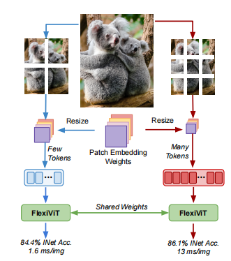

## 关键概念

### FlexViT

**概念**: ViT的灵活变体，能够在不同的Patch Size下工作，无需重新训练。

**背景**：
- 标准ViT与CNN的核心区别：ViT将图像切分为**不重叠的分块** (patches)，对每个分块线性映射得到tokens，进而进行Transformer运算。CNN则通过密集、重叠的卷积核提取特征。
- 标准ViT通常使用固定Patch Size：32×32、16×16、14×14，其中16×16最常见
- **问题**：训练的Patch Size是多少，推理时就只能用那个尺寸，改变Size需重新训练

**FlexViT的解决方案**：通过**权重插值**机制，使同一套权重能适配多个Patch Size


**FlexViT的关键机制**：
- 对位置编码进行**分辨率自适应插值**
- 使用**绝对位置编码** (而非相对位置) 以支持动态分辨率
- 在不同Patch Size间通过双线性插值调整权重




---
一个标准的ViT模型，训练时候的Patch Size是多大，它只能够在那个Patch Size的情况下取得良好的性能。当Patch Size改变时，一般模型就需要重新训练。

FlexViT就是希望训练一个适合所有Patch Size的ViT模型。

假设输入图像为:
$$x \in \mathbb{R}^{H\times W \times C}$$
设patch size为$P$, 即每个patch大小为$P\times P$，那么图像会被切为$N=\frac{HW}{P^2}$个patch。
每个Patch展平后是一个向量$x_p^i \in \mathbb{R}^{P^2C}, i=1,...,N$,所以整张图就变成了一个Patch序列：
$$[x_p^1,x_p^2,...,x_p^N]$$
这一步相当于把二维图像转换成了一维token序列。

#### Patch Embedding
二维图像直接展开为一维token后，需要先进行线性映射，映射到Transformer需要的隐藏维度$D$。定义一个线性投影矩阵：
$$E \in \mathbb{R}^{(P^2C)\times D}$$
那么第$i$个Patch的嵌入表示为：
$$z_i=x_p^iE$$
于是所有的patch的embedding拼起来得到：
$$Z=[x_p^1E;x_p^2E;...;x_p^NE] \in \mathbb{R}^{(N\times D)}$$

#### 加入分类token
ViT借鉴BERT，引入一个可学习的分类token $x_{cls} \in \mathbb{R}^{1\times D}$,把这个分类token拼接到patch token前面：
$$Z'=[x_{cls};Z] \in \mathbb{R}^{((N+1)\times D)}$$
这个cls token最后汇聚全局信息，用于分类。

#### 加入位置编码
Transformer本身不知道token的空间位置，所以需要加入位置编码：
$$E_{pos} \in \mathbb{R}^{(N+1)\times D}$$
输入给transformer的初始序列为：
$$Z_0=[x_{cls};x_p^1E;x_p^2E;...;x_p^NE] + E_{pos}$$
这个位置编码的作用是告诉模型哪个patch在左上角，哪个patch在中间，哪些patch相邻。

#### 送入Transformer Encoder
ViT一般只使用**Transformer Encoder**,不适用decoder。第l层输出记为$Z_l \in \mathbb{R}^{((N+1)\times D)}$。一层Transformer Encoder通常包含两部分：
1. Multi-Head Self-Attention
2. MLP/Feed Forward Network

并且每一部分都有残差连接和LayerNorm。标准写法：
$$\hat{Z}_l=Z_{l-1} + MSA(LN(Z_{l-1}))$$
$$Z_l = \hat{Z}_l + MLP(LN(\hat{Z}_l))$$
经过L层后得到$Z_l$。

#### OlmoEarth中Encoder部分代码
在olmoearth_pretrain/nn/flexi_vit.py中有Encoder class，
> 为什么olmo earth要自行实现attention算子？看起来也是最基本的实现，没有做什么优化，唯一可能的是对使用flash attention和不使用flash attention做的封装？olmoearth中attention的实现在nn/attention.py

下面是Encoder类中定义的神经网络层，主要是self.patch_embeddings，self.embedding_projector，self.project_and_aggregate。
```python
self.patch_embeddings = MultiModalPatchEmbeddings(
    self.supported_modality_names,
    self.max_patch_size,
    self.embedding_size,
    tokenization_config=self.tokenization_config,
    use_linear_patch_embed=self.use_linear_patch_embed,
    band_dropout_rate=self.band_dropout_rate,
    random_band_dropout=self.random_band_dropout,
    band_dropout_modalities=self.band_dropout_modalities,
)
self.output_embedding_size = output_embedding_size
# If output_embedding_size is set, project tokens to that size after attention
self.embedding_projector: ProjectAndAggregate | None = None
if output_embedding_size is not None:
    self.embedding_projector = ProjectAndAggregate(
        embedding_size=self.embedding_size,
        num_layers=1,
        output_embedding_size=output_embedding_size,
        only_project=True,
    )
    final_embedding_size = output_embedding_size
else:
    final_embedding_size = self.embedding_size
self.project_and_aggregate = ProjectAndAggregate(
    embedding_size=final_embedding_size,
    num_layers=num_projection_layers,
    aggregate_then_project=aggregate_then_project,
)
```
同时Encoder还从其基类FlexiVitBase中继承了self.blocks以及self.composite_encodings
```python
self.blocks = nn.ModuleList(
    [
        Block(
            embedding_size,
            num_heads,
            mlp_ratio,
            qkv_bias=True,
            qk_norm=qk_norm,
            norm_layer=nn.LayerNorm,  # TODO: This should be configurable
            cross_attn=self.cross_attn,
            drop_path=drop_path,
            use_flash_attn=self.use_flash_attn,
        )
        for _ in range(depth)
    ]
)
self.composite_encodings = CompositeEncodings(
    embedding_size,
    self.supported_modalities,
    max_sequence_length,
    learnable_channel_embeddings,
    random_channel_embeddings,
    tokenization_config=self._base_tokenization_config,
)
```

现在通过Encoder的forward函数确定Encoder各神经网络层连接
> forward函数一开始有个fastpass没看懂

```python
patchified_tokens_and_masks = self.patch_embeddings.forward(x, patch_size)
patchified_tokens_and_masks, token_norm_stats = self.apply_attn(
    x=patchified_tokens_and_masks,
    timestamps=x.timestamps,
    patch_size=patch_size,
    input_res=input_res,
    token_exit_cfg=token_exit_cfg,
    fast_pass=fast_pass,
)
output = TokensAndMasks(**patchified_tokens_and_masks)
output_dict: dict[str, Any] = {
    "tokens_and_masks": output,
}
```
看起来主要的工作都是在self.apply_attn中完成的。下面查看self.apply_attn函数的内容：
```python
# 它将 4 种关键信息 编码进 Token 嵌入（各占总维度的 1/4），让模型同时感知通道信息、时间信息、月份信息、空间信息，总嵌入维度被平均分为 4 份，分别给上述 4 种编码。
tokens_dict = self.composite_encodings.forward(
    tokens_only_dict,
    timestamps,
    patch_size,
    input_res,
)
# 猜测是将mask作用到tokens里面
tokens_dict.update(original_masks_dict)
# 维度变换？
tokens, mask = self.collapse_and_combine_hwtc(tokens_dict)
# 去掉掩码的token，为了节约算力？
tokens, indices, new_mask, seq_lengths, max_seqlen, bool_mask = (
    self._maybe_remove_masked_tokens(tokens, mask, fast_pass)
)
# Pack x tokens 也是维度变换
if self.use_flash_attn:
    cu_seqlens = get_cumulative_sequence_lengths(seq_lengths)
    og_shape = tokens.shape
    tokens = self.pack_tokens(tokens, new_mask)
else:
    cu_seqlens = None
# 对进入attn的部分加掩码
attn_mask = self._maybe_get_attn_mask(
    new_mask,
    fast_pass=fast_pass,
)
# 看后面register token是仿照BERT里面的CLS token
if self.has_register_tokens:
    tokens, attn_mask = self.add_register_tokens_and_masks(tokens, attn_mask)
# Apply attn with varying encoder depths
    for i_blk, blk in enumerate(self.blocks):
        ...
# 没看懂
if self.has_register_tokens:
    tokens, register_tokens = self.pop_register_tokens(tokens)
    token_norm_stats = (
        self.get_token_norm_stats(tokens, register_tokens)
        if self.log_token_norm_stats
        else None
    )
else:
    token_norm_stats = None
# 恢复被去掉的掩码？
tokens = self._maybe_add_removed_tokens(tokens, indices, new_mask, fast_pass)
```
> Encoder 部分差不多如上面所述，下面跳到Latent MIM部分看一下整体模型架构以及损失函数是怎么定义的

---

### Latent MIM

**概念**：Latent Masked Image Modeling，在**隐空间** (encoder输出) 而非像素空间进行mask prediction

**传统MIM的问题**：
- 标准MAE (Masked AutoEncoder) 在像素空间重建，低频信息易学，高频细节难学
- 对预训练表示的贡献有限

**Latent MIM的核心思想**：
让decoder预测的是**target encoder在masked位置的输出**，而非原始像素

**架构流程**：

```
Input (Multi-modality) 
    ↓
┌─────────────────┐        ┌──────────────────┐
│   Masking       │        │ Target Encoder   │◄── EMA副本 (冻结)
│   Strategy      │        │    (no grad)     │
└─────────────────┘        └──────────────────┘
    ↓                              ↓
┌─────────────────┐        ┌──────────────────┐
│ Online Encoder  │        │ Target Tokens    │(ground truth)
│   (masked in)   │        │ T_target ∈ ℝ^D  │
└─────────────────┘        └──────────────────┘
    ↓                              │
encoder_tokens                     │
    ↓                              │
┌─────────────────┐                │
│   Decoder       │────────────────┤
│  (Predictor)    │                │
└─────────────────┘                │
    ↓                              ↓
predicted_tokens ────→ [MSE Loss] ←─┘
(only at masked positions)
```

**数学表述**：

设输入为 $x \in \mathbb{R}^{H \times W \times T \times C}$，masking后的输入为 $x_m$

1. **Online Encoder** forward：
$$T_{\text{online}} = \text{Encoder}(x_m) \in \mathbb{R}^{N \times D}$$
其中 $N$ 是总token数，$D$ 是embedding维度

2. **Target Encoder** forward（停止梯度）：
$$T_{\text{target}} = \text{sg}(\text{TargetEncoder}(x)) \in \mathbb{R}^{N \times D}$$
其中 $\text{sg}(\cdot)$ 表示stop gradient操作

3. **Decoder** 预测masked位置：
$$\hat{T}_{\text{masked}} = \text{Decoder}(T_{\text{online}}) \in \mathbb{R}^{N_m \times D}$$

4. **Loss函数** (L2范数，仅在masked位置)：
$$\mathcal{L}_{\text{MIM}} = \left\| \hat{T}_{\text{masked}} - T_{\text{target,masked}} \right\|_2^2$$

**代码实现**：
下面是伪代码
```python
# Latent MIM训练步
def training_step(batch):
    x, mask = batch['image'], batch['mask']
    
    # Forward encoder (只看非masked tokens)
    encoder_tokens = encoder(x, mask=mask)  # [B, N, D]
    
    # Forward target encoder (看所有tokens，无grad)
    with torch.no_grad():
        target_tokens = target_encoder(x)  # [B, N, D]
    
    # Forward decoder (重建masked positions)
    predicted = decoder(encoder_tokens, mask=mask)  # [B, N_masked, D]
    
    # Loss: L2距离，masked位置的目标
    loss = F.mse_loss(predicted, target_tokens[mask], reduction='mean')
    return loss
```
在模型构建时首先调用的就是LatentMIMConfig，其中的build函数会构建LatentMIM模型，LatentMIM由self.encoder、self.decoder、self.reconstructor、self.target_encoder = deepcopy(self.encoder)组成。
```python
def forward(
    self, x: MaskedOlmoEarthSample, patch_size: int
) -> tuple[
    TokensAndMasks,
    TokensAndMasks,
    torch.Tensor,
    TokensAndMasks | None,
    dict[str, Any],
]:
    """Forward pass for the Latent MIM Style.

    Returns:
        latent: embeddings from encoder
        decoded: predictions from decoder for masked tokens
        latent_projected_and_pooled: pooled tokens for contrastive loss
        reconstructed: MAE predictions if enabled
    """
    # TODO: Input And outputs here are not consistent between encoder and decoder need a tokensandmaks++
    output_dict = self.encoder(x, patch_size=patch_size)
    token_norm_stats = output_dict.pop("token_norm_stats", None)
    latent, latent_projected_and_pooled, decoder_kwargs = unpack_encoder_output(
        output_dict
    )
    extra_metrics = {}
    if token_norm_stats is not None:
        extra_metrics["token_norm_stats"] = token_norm_stats
    reconstructed = None
    # 这里的reconstructor是对掩码部分的像素级重建
    if self.reconstructor:
        reconstructed = self.reconstructor(latent, x.timestamps, patch_size)
    decoded = self.decoder(
        latent, timestamps=x.timestamps, patch_size=patch_size, **decoder_kwargs
    )
    return (
        latent,
        decoded,
        latent_projected_and_pooled,
        reconstructed,
        extra_metrics,
    )
```

---

### Bandset

**概念**：同一传感器、相同分辨率的光谱波段组合，被视为模型的一个独立token组。

**应用背景**：
- 多源卫星数据通常有**多种分辨率**（如Sentinel-2有10m、20m、60m三个分辨率）
- 不同分辨率的波段不能直接拼接（会有几何失配）
- **解决方案**：将相同分辨率的波段分组，各自独立进行patch embedding

**Sentinel-2 的Band-set结构**（Sentinel-2有12个波段）：

| Band-set | 分辨率 | 波段 | 个数 |
|----------|--------|------|------|
| 0 | 10 m | B02(蓝), B03(绿), B04(红), B08(近红外) | 4 |
| 1 | 20 m | B05-B07, B8A, B11, B12 | 6 |
| 2 | 60 m | B01(海岸蓝), B09(水蒸气) | 2 |

**数学表述**：
对于包含多个band-set的模态，定义为：
$$\text{Modality} = \{B_0, B_1, \ldots, B_{k-1}\}$$

其中 $B_i \in \mathbb{R}^{H \times W \times T \times C_i}$。  
注：原始物理分辨率可不同（10m/20m/60m），但在当前数据管线中会先重采样到统一的 $H,W$ 后再进入模型。

在MultiModalPatchEmbeddings中，每个Band-set独立处理：
$$T_{i,j} = \text{FlexiPatchEmbed}(B_i), \quad T_{i,j} \in \mathbb{R}^{D}$$

最终的token张量：
$$\text{tokens} \in \mathbb{R}^{B \times h \times w \times T \times \text{num\_bandsets} \times D}$$
第一个B是batch size，$h、w$是图像切片的长宽，T是时间，num_bandsets是载荷bandset的个数是一个常数（对于Sentinel-2这个数是3），D是Embedding的维度。

```python
# Band-set处理示例
sentinel2_bands = {
    'band_set_0': [B02, B03, B04, B08],      # 10m
    'band_set_1': [B05, B06, B07, B8A, B11, B12],  # 20m
    'band_set_2': [B01, B09]                # 60m（在数据中存储为40m）
}

for band_set_name, bands in sentinel2_bands.items():
    # 各自进行patch embedding
    tokens = FlexiPatchEmbed(concat(bands), resolution=res[band_set_name])
```

---

### Target Encoder

**概念**：通过**Exponential Moving Average (EMA)** 维护的encoder副本，为decoder提供稳定的预测目标。

**设计动机**：
- 防止**表示坍缩** (representation collapse)：若decoder总是预测同一个向量，loss仍可很低
- EMA的缓变性确保目标 $T_{\text{target}}$ 保持稳定，提高训练稳定性
- 参数不直接优化，避免了目标移动过快

**EMA更新机制**：

在每个优化器步后：
$$\theta_{\text{target}}^{t+1} = \beta \cdot \theta_{\text{target}}^t + (1-\beta) \cdot \theta_{\text{online}}^t$$

其中：
- $\beta$ 是动量系数（通常0.99-1.0）
- OLMoEarth默认：$\beta = $ ema_decay: tuple[float, float] = (0.996, 1.0)（target几乎冻结，仅在初始化时更新）

**数学性质**：

EMA相当于对历史参数的加权平均：
$$\theta_{\text{target}}^t = \beta^t \theta_0 + (1-\beta) \sum_{i=0}^{t-1} \beta^{t-1-i} \theta_{\text{online}}^i$$

当 $\beta \to 1$ 时，权重集中在最早时刻；当 $\beta \to 0$ 时，权重集中在最新时刻

**代码实现**：
```python
class TargetEncoder:
    def __init__(self, encoder, ema_momentum=0.99):
        self.encoder = encoder
        self.target_encoder = copy.deepcopy(encoder)
        self.ema_momentum = ema_momentum
    
    def update(self):
        """在优化器step后调用"""
        for target_param, online_param in zip(
            self.target_encoder.parameters(),
            self.encoder.parameters()
        ):
            target_param.data = (
                self.ema_momentum * target_param.data +
                (1 - self.ema_momentum) * online_param.data
            )
    
    def forward(self, x):
        with torch.no_grad():
            return self.target_encoder(x)
```

---

### Composite Encodings

**概念**：将**位置、时间、月份、通道信息**编码为4个独立分量，分别占embedding维度的1/4

**设计原因**：
- 地球观测数据的多维特性：空间位置、时间序列、季节周期、多通道
- 分量隔离有利于模型学习独立的表示

**四个编码分量**：

| 分量 | 维度 | 编码方式 | 信息 |
|------|------|--------|------|
| **Spatial** | D/4 | 2D Sinusoidal，分辨率自适应 | 图像中的patch行列位置 |
| **Temporal** | D/4 | 1D Sinusoidal | 时间步索引 (0 to T-1) |
| **Month** | D/4 | 周期Sinusoidal，周期=12 | 日历月份 (0-11) |
| **Channel** | D/4 | 可学习embedding | 所属band-set (类别embedding) |

**数学表述**：

1. **Spatial Encoding** (2D Sinusoidal，分辨率自适应)：

给定patch位置 $(i, j)$ 和分辨率 $r$（单位：米），定义频率尺度 $\lambda = r / r_{\text{base}}$

$$PE_{\text{spatial}, 2k}(i) = \sin\left(\frac{i}{\lambda^{2k/(D/4)}}\right)$$
$$PE_{\text{spatial}, 2k+1}(i) = \cos\left(\frac{i}{\lambda^{2k/(D/4)}}\right)$$

同样对 $j$ 计算，在 $D/4$ 维度内拼接

2. **Temporal Encoding** (1D Sinusoidal)：

$$PE_{\text{temporal}, 2k}(t) = \sin\left(\frac{t}{10000^{2k/(D/4)}}\right)$$
$$PE_{\text{temporal}, 2k+1}(t) = \cos\left(\frac{t}{10000^{2k/(D/4)}}\right)$$

3. **Month Encoding** (周期Sinusoidal，周期T=12)：

$$PE_{\text{month}, 2k}(m) = \sin\left(\frac{2\pi m}{12} \cdot \frac{1}{10000^{2k/(D/4)}}\right)$$
$$PE_{\text{month}, 2k+1}(m) = \cos\left(\frac{2\pi m}{12} \cdot \frac{1}{10000^{2k/(D/4)}}\right)$$

4. **Channel Embedding** (可学习)：

$$E_{\text{channel}}^{c} \in \mathbb{R}^{D/4}, \quad c \in \{0, 1, \ldots, C_{\text{bandsets}}-1\}$$

**组合**：
$$\text{encoding}(i, j, t, m, c) = [PE_{\text{spatial}}(i, j) \| PE_{\text{temporal}}(t) \| PE_{\text{month}}(m) \| E_{\text{channel}}(c)]$$

其中 $\|$ 表示concatenation，最终维度为 $D$

**代码实现**：
```python
class CompositeEncodings:
    def __init__(self, dim=768):
        self.dim = dim
        self.channel_embeddings = nn.Embedding(num_modalities, dim // 4)
    
    def forward(self, positions, timesteps, months, band_idx, resolution_scale=1.0):
        # positions: [B, h, w] or flattened
        # timesteps: [T]
        # months: [T]
        # band_idx: scalar or [B]
        
        spatial_enc = self.sinusoidal_2d(positions, dim=self.dim//4, scale=resolution_scale)
        temporal_enc = self.sinusoidal_1d(timesteps, dim=self.dim//4)
        month_enc = self.sinusoidal_1d(months, dim=self.dim//4, period=12)
        channel_enc = self.channel_embeddings(band_idx)
        
        return torch.cat([spatial_enc, temporal_enc, month_enc, channel_enc], dim=-1)
```

---

### Modality Cross Masking

**概念**：在多模态预训练中，为每个模态**独立应用masking策略**，某些模态仅作为解码目标

**Masking策略类型**：`modality_cross_random` (默认，最强大)

**规则**：
1. 每个模态独立选择要mask的tokens
2. 50% tokens → Online Encoder 可见 (ONLINE_ENCODER)
3. 50% tokens → Decoder目标 (DECODER)
4. **Decode-only模态** (worldcover, srtm, osm, canopy等)：完全不进入encoder，仅作为重建目标

**MaskValue 枚举**：

```python
class MaskValue(IntEnum):
    ONLINE_ENCODER = 0          # Token被online encoder看到
    TARGET_ENCODER_ONLY = 1     # 仅target encoder看到（不预测）
    DECODER = 2                 # 仅decoder看到/预测（encoder不见）
    MISSING = 3                 # 数据缺失（无卫星覆盖）
```

**应用场景**：

对于Sentinel-2 (光学) 和 Worldcover (土地覆盖分类)：

```
Sentinel-2 tokens:  [ONLINE_ENC, ONLINE_ENC, ..., DECODER, DECODER, ...]
                     ├─ 50% online encoder见  │
                     └─ 50% decoder预测   ─────┘

Worldcover tokens:  [DECODER, DECODER, ..., DECODER, DECODER, ...]
                     └─ 100% decoder预测，encoder完全不见
                        （模型学习：从光学推断土地覆盖）
```

**数学表述**：

设 $M_k \in \{0,1,2,3\}^{N_k}$ 为模态 $k$ 的mask向量，$N_k$ 是该模态的token数

对于策略 `modality_cross_random`：
- 采样 $I_k^{\text{encode}} \subset \{1, \ldots, N_k\}, |I_k^{\text{encode}}| = 0.5 \cdot N_k$
- 采样 $I_k^{\text{decode}} = \{1, \ldots, N_k\} \setminus I_k^{\text{encode}}$

则：
$$M_k[i] = \begin{cases}
0 & \text{if } i \in I_k^{\text{encode}} \text{ (ONLINE\_ENCODER)} \\
2 & \text{if } i \in I_k^{\text{decode}} \text{ (DECODER)} \\
3 & \text{if data missing}
\end{cases}$$

对于decode-only模态（如worldcover）：
$$M_{\text{wo}}[i] = 2 \quad \forall i$$

**代码**：
```python
def modality_cross_random(sample: OlmoEarthSample, mask_ratio=0.5):
    """独立为各模态应用随机mask"""
    masked_sample = MaskedOlmoEarthSample()
    
    for modality_name in MODALITY_NAMES:
        tokens = getattr(sample, modality_name)
        if tokens is None:
            continue
        
        N = tokens.shape.numel()
        mask = torch.full((N,), MaskValue.ONLINE_ENCODER)
        
        if modality_name in DECODE_ONLY_MODALITIES:
            # 整个模态仅用于decoder
            mask[:] = MaskValue.DECODER
        else:
            # 随机mask 50%
            indices = torch.randperm(N)
            mask[indices[:N//2]] = MaskValue.DECODER
        
        setattr(masked_sample, f"{modality_name}_mask", mask)
    
    return masked_sample
```

---

### Band Dropout

**概念**：在训练时，随机将某些光谱波段清零，强制模型学习**波段间的交叉表示**

**设计动机**：
- 单个波段信息有限；多光谱学习应依赖多个波段
- Band dropout迫使模型不过度依赖单一波段
- 提高鲁棒性：模拟实际应用中可能的波段缺失

**数学表述**：

给定输入 $x \in \mathbb{R}^{B \times H \times W \times T \times C}$（batch, height, width, time, channels）

Band dropout 以概率 $p_b$ 对第 $c$ 个通道进行mask：

$$x'_{:,:,:,:,c} = \begin{cases}
0 & \text{with probability } p_b \\
x_{:,:,:,:,c} & \text{with probability } 1 - p_b
\end{cases}$$

等价地，使用mask向量 $m_c \sim \text{Bernoulli}(1-p_b)$：
$$x'_{:,:,:,:,c} = m_c \cdot x_{:,:,:,:,c}$$

**应用时机**：
- **仅在训练期间** (train mode)
- **在FlexiPatchEmbed之前** (patch embedding前应用)
- 不影响inference

**超参数**：
- `band_dropout_rate` ∈ [0, 1]，OLMoEarth通常设为 0.0 ~ 0.2

**代码实现**：
```python
class MultiModalPatchEmbeddings(nn.Module):
    def __init__(self, band_dropout_rate=0.1):
        self.band_dropout_rate = band_dropout_rate
    
    def forward(self, sample: MaskedOlmoEarthSample, training=True):
        if training and self.band_dropout_rate > 0:
            # 为各模态应用band dropout
            for modality_name in MODALITY_NAMES:
                x = getattr(sample, modality_name)
                if x is None:
                    continue
                
                # x: [B, H, W, T, C]
                # 随机mask通道维度
                C = x.shape[-1]
                mask = torch.bernoulli(
                    torch.ones(C) * (1 - self.band_dropout_rate)
                ).to(x.device)
                
                x = x * mask.view(1, 1, 1, 1, -1)
                setattr(sample, modality_name, x)
        
        # 继续patch embedding
        tokens = self.patch_embed(sample)
        return tokens
```

---

### Token Budget

**概念**：对单个样本的**总token数设定上限**，保证GPU内存消耗可控

**背景**：
- 不同空间crop大小 → 不同patch数
- 不同时间窗口 → 不同时间步
- Token总数 = $\sum_k h_k \times w_k \times T \times \text{num\_bandsets}_k$
- 无约束时，某些样本可能产生数千tokens，爆内存

**Token预算制约**：

$$N_{\text{total}} = \sum_k h_k \times w_k \times T \times n_{bs,k} \leq N_{\text{budget}}$$

其中：
- $h_k, w_k$ 是模态 $k$ 的patch网格尺寸
- $T$ 是时间步数
- $n_{bs,k}$ 是band-sets个数
- $N_{\text{budget}}$ 通常为 2250 (OLMoEarth Base)

**动态patch size调整**：

若当前budget用尽，dataloader动态调整patch size：

$$P_{\text{adjusted}} = \arg\min_P \left| N_{\text{total}}(P) - N_{\text{budget}} \right|$$

通过从预定义的patch size列表 `sampled_hw_p_list = [1, 2, 3, ..., 12]` 中选择

**代码流程**：
```python
class OlmoEarthDataset:
    def __init__(self, token_budget=2250, sampled_hw_p_list=[1,2,3,...,12]):
        self.token_budget = token_budget
        self.sampled_hw_p_list = sampled_hw_p_list
    
    def __getitem__(self, idx):
        sample = self.load_h5(idx)
        
        # 尝试不同patch size，选择不超预算的最大尺度
        for patch_size in reversed(self.sampled_hw_p_list):
            num_patches_h = sample['height'] // patch_size
            num_patches_w = sample['width'] // patch_size
            
            # 估计总token数
            total_tokens = 0
            for modality in sample.keys():
                if modality in MODALITIES:
                    bs_count = MODALITIES[modality]['bandsets']
                    total_tokens += num_patches_h * num_patches_w * bs_count
            
            if total_tokens <= self.token_budget:
                return sample, patch_size
        
        # fallback
        return sample, self.sampled_hw_p_list[0]
```

---

### Register Tokens

**概念**：在sequence前端**prepend可学习的特殊tokens**，提升训练稳定性和表示质量

**设计灵感**：
- Vision Transformer 中的 `[CLS]` token
- DeiT 中的distillation tokens
- 但register tokens不用作分类或池化，仅作为"buffer"

**作用机制**：
1. Transformer注意力在处理真实patch tokens前，可先"消化"register tokens
2. 吸收注意力权重的异常值，保护patch tokens
3. 提供额外的参数化灵活性

**数学表述**：

设注册tokens数量为 $n_r$，embedding维度为 $D$

定义可学习参数：
$$R \in \mathbb{R}^{n_r \times D}$$

在patch embedding之后，prepend到序列：
$$T_{\text{with\_reg}} = \text{concat}(R, T_{\text{patches}})$$

其中：
- 输入序列维度：$(B, N + n_r, D)$
- $N$ 是patch数，$n_r$ 是register token数

在decoder中，register tokens也被prepend，防止positional encoding混乱

**代码**：
```python
class FlexiViT(nn.Module):
    def __init__(self, num_register_tokens=0, embedding_size=768):
        self.num_register_tokens = num_register_tokens
        if num_register_tokens > 0:
            self.register_tokens = nn.Parameter(
                torch.randn(1, num_register_tokens, embedding_size)
            )
            nn.init.normal_(self.register_tokens, std=0.02)
    
    def forward(self, patch_tokens: Tensor) -> Tensor:
        # patch_tokens: [B, N, D]
        if self.num_register_tokens > 0:
            B = patch_tokens.shape[0]
            reg = self.register_tokens.expand(B, -1, -1)
            patch_tokens = torch.cat([reg, patch_tokens], dim=1)
        
        # Transformer blocks
        x = self.transformer(patch_tokens)
        return x
```

**超参数**：
- OLMoEarth默认：`num_register_tokens=0`（可通过config调整）
- 若启用，通常设为 4-8 个

---

### KoLeo Regularizer

**概念**：正则化损失项，**鼓励embeddings均匀分布在特征空间**，防止表示坍缩 (collapse)

**问题背景**：
- 无监督训练易出现所有样本映射到接近位置的现象（坍缩）
- 单纯L2 loss不足以防止
- 需显式正则化促进多样性

**KoLeo的定义**：

对于一个batch的embeddings $\{e_i\}_{i=1}^B \in \mathbb{R}^D$（L2归一化）

KoLeo loss定义为：
$$\mathcal{L}_{\text{KoLeo}} = -\mathbb{E}_{i} \left[ \log(d_{i,\text{nn}}) \right]$$

其中 $d_{i,\text{nn}}$ 是样本 $i$ 到最近邻的**最小距离**：
$$d_{i,\text{nn}} = \min_{j \neq i} \| e_i - e_j \|_2$$

**直观解释**：
- 若embeddings聚集，$d_{i,\text{nn}}$ 很小，$\log(d_{i,\text{nn}})$ 很负，loss很大 → 惩罚坍缩
- 若embeddings分散，$d_{i,\text{nn}}$ 较大，loss较小 → 鼓励多样性

**组合损失**：

总训练损失为：
$$\mathcal{L}_{\text{total}} = \mathcal{L}_{\text{patch\_disc}} + \lambda_{\text{contrastive}} \mathcal{L}_{\text{contrastive}} + \lambda_{\text{koleo}} \mathcal{L}_{\text{KoLeo}}$$

其中：
- $\mathcal{L}_{\text{patch\_disc}}$ 是主要的Latent MIM损失
- $\lambda_{\text{contrastive}}, \lambda_{\text{koleo}}$ 是权重系数

#### $\mathcal{L}_{\text{patch\_disc}}$：Patch Discrimination Loss（Latent MIM核心损失）

**本质**：让decoder预测被masked位置的**target encoder输出**，而非原始像素。

**数学定义**：

设Online Encoder输出为 $T_{\text{online}} \in \mathbb{R}^{N \times D}$，Target Encoder（EMA副本，停止梯度）输出为 $T_{\text{target}} \in \mathbb{R}^{N \times D}$，Decoder对masked位置的预测为 $\hat{T}_{\text{masked}} \in \mathbb{R}^{N_m \times D}$，则：

$$\mathcal{L}_{\text{patch\_disc}} = \left\| \hat{T}_{\text{masked}} - T_{\text{target,masked}} \right\|_2^2$$

**直观理解**：
- Decoder只需在**隐空间**对齐预测，而不必还原低级像素信息
- Target Encoder由EMA缓慢更新，提供稳定目标，防止训练坍缩
- 相比像素级MSE，隐空间目标携带更多语义信息（高频结构、上下文关系）

**命名来源**："patch discrimination"强调模型需区分不同patch的语义，而非盲目平均。

---

#### $\mathcal{L}_{\text{contrastive}}$：对比学习损失（Image-level）

**本质**：拉近同一图像不同增强视图的全局表示，推远不同图像的表示，学习**图像级语义一致性**。

**数学定义（InfoNCE形式）**：

对batch中图像 $i$，其两个增强视图的pooled embedding为 $z_i^+, z_i^-$，其余图像embeddings为 $\{z_j\}_{j \neq i}$：

$$\mathcal{L}_{\text{contrastive}} = -\frac{1}{B} \sum_{i=1}^{B} \log \frac{\exp(\text{sim}(z_i^+, z_i^-) / \tau)}{\sum_{j=1}^{B} \exp(\text{sim}(z_i^+, z_j) / \tau)}$$

其中 $\text{sim}(\cdot, \cdot)$ 为余弦相似度，$\tau$ 为温度超参数（通常0.07-0.2）。

**在OLMoEarth中的输入**：
- `latent_projected_and_pooled`：encoder输出经projection head后的pooled token（见forward返回值）
- 多模态场景下，不同时间戳或不同传感器的同一地点视图可互为正样本对

**作用**：
- patch_disc学习patch级局部特征，contrastive loss学习图像级全局语义
- 两者互补：前者捕获细粒度空间结构，后者强化跨视图语义不变性

**与KoLeo的区别**：
- contrastive loss需要**明确的正负样本对**
- KoLeo无需对，直接在batch内推开所有embeddings，纯防坍缩

**代码实现**：
```python
def koleo_loss(embeddings: Tensor) -> Tensor:
    """
    embeddings: [B, D] — L2 normalized
    Returns: scalar loss
    """
    # 计算pairwise distances (cosine)
    # embeddings已归一化，所以距离 = 2 - 2*cosine_sim
    similarity = torch.mm(embeddings, embeddings.T)  # [B, B]
    
    # 置对角线为inf，排除自己
    similarity = similarity.masked_fill(
        torch.eye(embeddings.shape[0], device=embeddings.device, dtype=torch.bool),
        -float('inf')
    )
    
    # 最大相似度（最小距离）
    max_sim = similarity.max(dim=1)[0]
    
    # 转换为距离
    min_distance = torch.clamp(2 - 2 * max_sim, min=1e-6)
    
    # KoLeo loss
    loss = -torch.log(min_distance).mean()
    return loss

# 训练loop中
loss_total = loss_patch_discrimination + 0.1 * koleo_loss(pooled_embeddings)
```

---

## Tensor 维度全流程图

以 **Sentinel-2 L2A** 为主线，`batch_size=B`，`patch_size=8`，`T=12`，`D=128`，`N_budget=2250`。

---

### 图1：H5 文件读取 → MaskedOlmoEarthSample

```
磁盘 H5 文件
│
│  sentinel2_l2a  [256, 256, 12, 12]   (H, W, T, C_total，全 bandset upsample 到同一尺寸)
│  sentinel1      [256, 256, 12,  2]
│  worldcover     [256, 256,  1,  1]
│  timestamps     [12, 3]              (T, [day, month, year])
│  latlon         [2]
│
▼ OlmoEarthDataset.__getitem__()
│  空间 crop（sampled_hw_p 控制 patch 数量）
│  sentinel2_l2a  [H_crop, W_crop, T, 12]   e.g. H_crop=W_crop=64 (8 patches × 8px/patch)
│
▼ MaskingStrategy.apply_mask()
│
│  sentinel2_l2a        [H_crop, W_crop, T, 12]   原始像素
│  sentinel2_l2a_mask   [H_crop, W_crop, T,  3]   每个 bandset 一个 mask 值
│                                                  值域: {0=ONLINE, 1=TARGET_ONLY, 2=DECODER, 3=MISSING}
│  (3 bandsets: 10m/20m/60m，其中60m在数据中存储为40m)
│
└─→ MaskedOlmoEarthSample (单样本，无 batch 维)
```

---

### 图2：Patch Embedding → MultiModal Token Tensor

```
MaskedOlmoEarthSample
│
│  sentinel2_l2a  [H_crop, W_crop, T, 12]
│  按 bandset 拆分:
│    bandset-0 (10m, 4 ch):  [64, 64, 12,  4]
│    bandset-1 (20m, 6 ch):  [64, 64, 12,  6]
│    bandset-2 (60m/存储为40m, 2 ch):  [64, 64, 12,  2]
│
▼ FlexiPatchEmbed（patch_size=8 at 10m reference）
│  每个 bandset 独立 patch embed (Linear projection)
│
│    bandset-0: [B, 64, 64, 12,  4] → [B, 8,  8,  12, 128]   h_p=64//8=8
│    bandset-1: [B, 64, 64, 12,  6] → [B, 8,  8,  12, 128]
│    bandset-2: [B, 64, 64, 12,  2] → [B, 8,  8,  12, 128]
│
▼ stack across bandsets (dim=-2)
│
│  sentinel2_l2a tokens: [B, h_p, w_p, T, num_bandsets, D]
│  各 bandset 在输入和 patchify 后的 h_p/w_p 一致，可直接 stack
│  → 实际展平为 token 序列: [B, N_s2, D]
│     N_s2 = h_p × w_p × T × num_bandsets
│     示例(64×64 crop, patch_size=8, T=12, num_bandsets=3):
│     N_s2 = 8×8×12×3 = 2304
│     (训练时会通过 sampled_hw_p / T 的动态裁剪满足 token budget)
│
▼ 合并所有模态
│
│  所有模态 token 拼接: [B, N_total, D]
│     N_total ≤ N_budget (= 2250)
│
└─→ TokensAndMasks  (带 mask 标记的 token 序列)
```

---

### 图3：Composite Encodings 叠加

```
Token embedding  [B, N_total, D=128]
│
│  D 按 1/4 划分为 4 份（各 32 维）:
│
│  + Spatial Encoding    [B, N, 32]   2D sinusoidal，编码 patch 的 (i,j) 位置和分辨率
│  + Temporal Encoding   [B, N, 32]   编码时间步索引 t ∈ [0, T-1]
│  + Month Encoding      [B, N, 32]   编码采集月份（周期性 sin/cos）
│  + Channel Encoding    [B, N, 32]   编码 bandset 类型
│
▼ 相加融合
│
└─→ Positioned tokens  [B, N_total, D=128]
```

---

### 图4：Online Encoder & Target Encoder

```
                    MaskedOlmoEarthSample
                    ┌──────────┴────────────┐
                    │                       │ .unmask() → 所有 token 可见
                    ▼                       ▼
            Online Encoder           Target Encoder (EMA副本，no_grad)
            [仅 ONLINE token 可见]    [全部 token 可见]
                    │                       │
      Transformer (L 层 self-attention)      Transformer (相同结构)
      [B, N_online, D]                      [B, N_total, D]
                    │                       │
                    ▼                       ▼
           latent (TokensAndMasks)   target_output (TokensAndMasks)
           [B, N_online, D=128]      [B, N_total, D=128]
                    │
          ┌─────────┴──────────┐
          │                    │
          ▼                    ▼
  project & pool         传给 Decoder
  [B, D=128]             (见图5)
  (用于 contrastive loss)
```

---

### 图5：Decoder → 预测输出

```
latent (Online Encoder 输出)  [B, N_online, D=128]
│
▼ encoder_to_decoder_embed (Linear)
│  [B, N_online, D_dec=128]
│
▼ 填充 mask tokens
│  在 DECODER / TARGET_ONLY 位置插入可学习 mask_token [D_dec]
│  [B, N_total, D_dec=128]
│
▼ Decoder Transformer (L_dec 层 self-attention)
│  [B, N_total, D_dec=128]
│
▼ to_output_embed (Linear, 按 bandset 独立)
│  per bandset: [B, h_p, w_p, T, D_dec] → [B, h_p, w_p, T, D_out]
│
└─→ decoded (TokensAndMasks)
    [B, N_total, D_out=128]   (仅在 DECODER 位置计算 loss)
```

---

### 图6：损失函数计算

```
decoded  [B, N_total, D_out]          target_output [B, N_total, D_out]
pooled   [B, D]                       pooled_target  [B, D]
                                      koleo_embed    [B, D]

━━━━━━━━━━━━━━━━━━━━━━━━━━━━━━━━━━━━━━━━━━━━━━━━━━━━━━━━━━━━━━━
① L_patch_disc   (Patch Discrimination，token 级对比)
━━━━━━━━━━━━━━━━━━━━━━━━━━━━━━━━━━━━━━━━━━━━━━━━━━━━━━━━━━━━━━━
│
│  筛选 DECODER mask 的 token:
│    pred_dec    [N_dec, D_out]
│    target_dec  [N_dec, D_out]
│
│  L2 normalize → 计算相似度矩阵:
│    scores = pred_dec @ target_dec.T / τ   [N_dec, N_dec]
│
│  对角线为正样本（预测第 i 个 → 目标第 i 个）:
│    labels = [0, 1, 2, ..., N_dec-1]
│    L_patch_disc = CrossEntropy(scores, labels)   → scalar
│
━━━━━━━━━━━━━━━━━━━━━━━━━━━━━━━━━━━━━━━━━━━━━━━━━━━━━━━━━━━━━━━
② L_contrastive  (InfoNCE，图像级对比)
━━━━━━━━━━━━━━━━━━━━━━━━━━━━━━━━━━━━━━━━━━━━━━━━━━━━━━━━━━━━━━━
│
│  pooled        [B, D]   (online encoder 全局池化)
│  pooled_target [B, D]   (target encoder 全局池化)
│
│  logits = pooled @ pooled_target.T / τ   [B, B]
│  labels = [0, 1, ..., B-1]
│  L_contrastive = CrossEntropy(logits, labels)   → scalar
│
━━━━━━━━━━━━━━━━━━━━━━━━━━━━━━━━━━━━━━━━━━━━━━━━━━━━━━━━━━━━━━━
③ L_koleo  (KoLeo 正则，防坍缩)
━━━━━━━━━━━━━━━━━━━━━━━━━━━━━━━━━━━━━━━━━━━━━━━━━━━━━━━━━━━━━━━
│
│  koleo_embed  [B, D]   (pooled embeddings，L2 normalized)
│
│  d_nn = min_{j≠i} ||e_i - e_j||_2   (每个样本到最近邻距离)
│  L_koleo = -mean(log(d_nn))   → scalar
│
━━━━━━━━━━━━━━━━━━━━━━━━━━━━━━━━━━━━━━━━━━━━━━━━━━━━━━━━━━━━━━━
总损失
━━━━━━━━━━━━━━━━━━━━━━━━━━━━━━━━━━━━━━━━━━━━━━━━━━━━━━━━━━━━━━━
│
│  L_total = L_patch_disc + λ_contrastive × L_contrastive + λ_koleo × L_koleo
│            ─────────────   ────────────────────────────   ──────────────────
│            token级语义对齐      图像级语义不变性              防表示坍缩
│
└─→ backward() → 仅更新 Online Encoder + Decoder 参数
                 Target Encoder 由 EMA 被动更新
```

---

### 关键维度速查表

| 阶段 | 张量 | 形状 | 说明 |
|------|------|------|------|
| H5 读取 | `sentinel2_l2a` | `[256, 256, 12, 12]` | H×W×T×C，全 bandset upsample 到 256×256 |
| Crop 后 | `sentinel2_l2a` | `[64, 64, 12, 12]` | sampled_hw_p=8，patch_size=8 |
| 掩码 | `sentinel2_l2a_mask` | `[64, 64, 12, 3]` | 每 bandset 一个 mask 值 |
| Patch embed 后 | bandset-0 | `[B, 8, 8, 12, 128]` | h_p=64//8=8 |
| Token 序列 | 全模态拼接 | `[B, N_total, 128]` | N_total ≤ 2250 |
| + Composite Enc | 同上 | `[B, N_total, 128]` | 4×32 编码相加 |
| Encoder 输出 | `latent` | `[B, N_online, 128]` | 仅 ONLINE token |
| Encoder 池化 | `pooled` | `[B, 128]` | 用于 contrastive |
| Target Encoder | `target_output` | `[B, N_total, 128]` | 全 token，no_grad |
| Decoder 输出 | `decoded` | `[B, N_total, 128]` | 含 mask token 预测 |
| patch_disc 输入 | `pred_dec / target_dec` | `[N_dec, 128]` | 仅 DECODER token |
| contrastive 输入 | `pooled / pooled_target` | `[B, 128]` | 图像级 |
| KoLeo 输入 | `koleo_embed` | `[B, 128]` | 池化 embedding |
| 各 loss | — | scalar | 加权求和得 L_total |

---

## 概念总结表

| 概念 | 作用 | 关键参数 |
|------|------|---------|
| **FlexViT** | 多分辨率patch size适配 | max_patch_size, min_patch_size |
| **Band-set** | 多分辨率波段分组 | 按传感器和分辨率分组 |
| **Latent MIM** | 隐空间重建预训练 | embedding_size, decoder_depth |
| **Target Encoder** | EMA稳定目标 | ema_momentum ≈ 0.99-1.0 |
| **Composite Encodings** | 位置/时间/月份/通道编码 | D/4 维度分配 |
| **Modality Cross Masking** | 独立模态掩码策略 | mask_ratio = 0.5 |
| **Band Dropout** | 波段级dropout | band_dropout_rate ∈ [0, 0.2] |
| **Token Budget** | 序列长度约束 | N_budget ≈ 2250 |
| **Register Tokens** | 训练稳定性 | num_register_tokens ∈ [0, 8] |
| **KoLeo Regularizer** | 防表示坍缩 | λ_koleo ≈ 0.1 |

---

## 添加可见光数据集的训练修改方案

### 一、概述

OLMoEarth 的数据管线以 **H5PY 文件** 为核心，每个模态通过 `ModalitySpec` 声明，再经由统一的 `OlmoEarthDataset` 加载。添加可见光数据集（如 PlanetScope、NAIP、高分系列等）需要完成以下四类工作：

1. **声明模态**（`constants.py`）：告诉模型新数据长什么样
2. **提供归一化统计**（`norm_configs/*.json`）：提供 per-band 均值/标准差
3. **注册到训练配置**（`scripts/official/base.py`）：将新模态加入训练流
4. **准备 H5PY 数据**：将原始栅格数据转换为框架规定格式

下面以 **PlanetScope RGBNIR（4 波段，3 m 分辨率，月度时序）** 为具体示例，所有步骤均可类推到其他可见光源。

---

### 二、数据集格式要求

#### 2.1 H5PY 文件结构

每个样本对应一个 `.h5` 文件，文件内必须包含以下 key（已有模态只需保留，新模态追加）：

```
sample_XXXXX.h5
├── latlon                          [2]         float32   (纬度, 经度)
├── timestamps                      [T, 3]      int32     (day, month, year) 每时间步一行
├── <新模态名>                       [H, W, T, C]  int16   多时相数据
│   或                               [H, W, C]   int16   静态数据
└── missing_timesteps_masks/
    └── <新模态名>                   [T]         bool      True=该时间步数据缺失
```

#### 2.2 空间规格

| 参数 | 要求 | 说明 |
|------|------|------|
| 空间尺寸 | **256 × 256** 像素（tile 级别） | 与其他模态保持一致的地理范围 |
| 地理对齐 | 与 Sentinel-2 tile 共享同一地理范围 | 必须重采样到与 Sentinel-2 空间对齐 |
| 坐标系 | EPSG:32601~32660（UTM zone） | 与 Sentinel-2 L2A 产品一致 |
| 分辨率 | 任意，但需在 `ModalitySpec` 中声明 | 框架会自动按 `tile_resolution_factor` 换算 |

**注意**：256 × 256 是在 **Sentinel-2 10 m 分辨率**下的 tile 尺寸（即覆盖 2560 m × 2560 m 地理范围）。若可见光数据分辨率为 3 m，则同一地理范围对应约 **853 × 853** 像素，框架在 `BandSet` 中通过 `resolution_factor` 参数自动处理这一关系。

#### 2.3 时序规格

| 参数 | 要求 |
|------|------|
| 时间步 | 最多 12 步（与 `max_sequence_length=12` 对应） |
| 时间戳 | 每步记录 `[day, month, year]`（int32） |
| 缺失步 | 用 `missing_timesteps_masks/<模态名>` 布尔数组标记 |

#### 2.4 数值范围与数据类型

- 存储格式：`int16`（原始 DN 值或 reflectance × 10000）
- 值域示例：Planet NICFI surface reflectance × 10000，范围约 `[0, 10000]`
- 后续由 `Normalizer` 读取 JSON 统计做 z-score 或 min-max 归一化

---

### 三、需要修改的文件清单

| 优先级 | 文件路径 | 修改内容 |
|--------|----------|----------|
| **P1（必改）** | `olmoearth_pretrain/data/constants.py` | 添加新 `ModalitySpec` |
| **P1（必改）** | `olmoearth_pretrain/data/norm_configs/predefined.json` 或 `computed.json` | 添加 per-band 归一化统计 |
| **P1（必改）** | `scripts/official/base.py`（或所用训练脚本） | 将新模态加入 `training_modalities` |
| **P2（按需）** | `olmoearth_pretrain/train/masking.py` | 若新模态仅作为辅助目标，加入 `DECODE_ONLY_MODALITIES` |
| **P2（按需）** | `olmoearth_pretrain/nn/tokenization.py` | 若需自定义波段分组方式 |
| **P3（数据准备）** | 新建转换脚本（参考 `olmoearth_pretrain/dataset/convert_to_h5py.py`） | 将原始 GeoTIFF 转为 H5PY |

---

### 四、详细修改步骤

#### 步骤 1：在 `constants.py` 中声明新模态

**文件**：`olmoearth_pretrain/data/constants.py`

找到 `class Modality`，在已有模态之后追加：

```python
class Modality:
    # ... 已有模态 ...

    # ── 新增：PlanetScope RGBNIR 可见光数据集 ──
    PLANET_RGBNIR = ModalitySpec(
        name="planet_rgbnir",          # 与 H5PY key 一致
        tile_resolution_factor=16,     # 以 Sentinel-2 10 m 为参考基准
        band_sets=[
            # 3 m 分辨率，4 个可见光/近红外波段
            # 16 × (10 m / 3 m) ≈ 53，取整为 48（8 的倍数，便于 patch embedding）
            BandSet(["Red", "Green", "Blue", "NIR"], 48),
        ],
        is_multitemporal=True,          # 月度时序数据
        ignore_when_parsing=False,
    )
```

**`tile_resolution_factor` 含义**：

源码定义（`constants.py`）：
```
BASE_RESOLUTION = 0.625  # 米/像素，系统最高分辨率基准
IMAGE_TILE_SIZE = 256     # 标准 tile 像素尺寸
tile_resolution = BASE_RESOLUTION * tile_resolution_factor
```

`tile_resolution_factor` 表示：**该模态的 tile 分辨率是 BASE_RESOLUTION（0.625 m/pixel）的多少倍**，即每个像素代表多少米地面。

换言之，它同时决定了：
1. **像素分辨率**：`tile_resolution = 0.625 × tile_resolution_factor` 米/pixel
2. **地理覆盖范围**：`256 × tile_resolution` 米（tile 边长）

| tile_resolution_factor | 分辨率 | 256×256 tile 覆盖范围 | 典型数据源 |
|------------------------|--------|----------------------|------------|
| 1 | 0.625 m/px | 160 m × 160 m | NAIP (原始) |
| 16 | 10 m/px | 2560 m × 2560 m | Sentinel-2 |
| 256 | 160 m/px | 40960 m × 40960 m | 粗分辨率气象数据 |

**关键规则**：所有模态的 tile 必须覆盖**相同的地理范围**（即在地理空间上对齐）。因此不同分辨率的模态会有不同的像素尺寸，但 `tile_resolution_factor` 确保框架知道如何对齐它们。

例如，NAIP（0.625 m/px，`tile_resolution_factor=1`）与 Sentinel-2（10 m/px，`tile_resolution_factor=16`）同时使用时：
- NAIP tile：256 × 256 px，覆盖 160m
- Sentinel-2 tile：256 × 256 px，覆盖 2560m
- 两者**覆盖范围不同**，不是同一地块的不同视角，而是框架通过地理坐标对齐采样区域

---

**`tile_resolution_factor` 与 BandSet resolution_factor 换算规则**：

$$\text{BandSet factor} = \text{tile\_resolution\_factor} \times \frac{\text{模态分辨率 (m)}}{\text{基准分辨率 (m)}}$$

以 10 m 为基准（Sentinel-2 最高分辨率）：

| 可见光数据源 | 分辨率 | 建议 BandSet factor |
|------------|--------|-------------------|
| Sentinel-2 RGB (B02/B03/B04) | 10 m | 16 |
| PlanetScope RGBNIR | 3 m | 48 |
| NAIP (USA) | 0.6 m | 240（或 256） |
| 高分二号 | 0.8 m | 192（或 208） |

若目标只使用 **Sentinel-2 的可见光波段**（B02/B03/B04），无需新增模态，只需在 `TokenizationConfig` 中将 `sentinel2_l2a` 的第一个 band-set 单独使用即可。

---

#### 步骤 2：添加归一化统计（`norm_configs/predefined.json`）

**文件**：`olmoearth_pretrain/data/norm_configs/predefined.json`

在 JSON 根对象中添加新 key（key 必须与 `ModalitySpec.name` 一致）：

```json
{
  "sentinel2_l2a": { ... },
  "sentinel1": { ... },

  "planet_rgbnir": {
    "Red":   {"min": 0,    "max": 3000},
    "Green": {"min": 0,    "max": 3000},
    "Blue":  {"min": 0,    "max": 2500},
    "NIR":   {"min": 0,    "max": 5000}
  }
}
```

若使用 `computed.json`（z-score 归一化），格式为：

```json
{
  "planet_rgbnir": {
    "Red":   {"mean": 850,  "std": 620},
    "Green": {"mean": 900,  "std": 580},
    "Blue":  {"mean": 700,  "std": 530},
    "NIR":   {"mean": 2400, "std": 1100}
  }
}
```

**获取统计值的方法**：对训练集中 1000+ 样本随机采样，逐波段计算均值和标准差：

```python
import h5py, numpy as np, glob

band_names = ["Red", "Green", "Blue", "NIR"]
sums = np.zeros(4); sq_sums = np.zeros(4); counts = np.zeros(4)

for path in glob.glob("/path/to/h5data/sample_*.h5"):
    with h5py.File(path) as f:
        if "planet_rgbnir" not in f:
            continue
        data = f["planet_rgbnir"][:]   # [H, W, T, 4]
        mask = ~f["missing_timesteps_masks/planet_rgbnir"][:]  # [T]
        valid = data[:, :, mask, :]    # 只统计非缺失时步
        for i in range(4):
            vals = valid[:, :, :, i].ravel().astype(np.float64)
            sums[i] += vals.sum(); sq_sums[i] += (vals**2).sum(); counts[i] += len(vals)

means = sums / counts
stds  = np.sqrt(sq_sums / counts - means**2)
for i, b in enumerate(band_names):
    print(f'"{b}": {{"mean": {means[i]:.1f}, "std": {stds[i]:.1f}}}')
```

---

#### 步骤 3：（可选）配置 Masking 策略（`masking.py`）

**文件**：`olmoearth_pretrain/train/masking.py`

默认情况下，新模态与 Sentinel-2 一样，50% tokens 进 online encoder，50% 进 decoder。

若希望新可见光数据集仅作为**辅助解码目标**（模型从雷达/多光谱推断可见光），则加入 `DECODE_ONLY_MODALITIES`：

```python
DECODE_ONLY_MODALITIES = {
    "worldcover",
    "srtm",
    "osm",
    # 可选：将可见光设为纯解码目标
    # "planet_rgbnir",
}
```

**建议**：若可见光数据在训练集中覆盖率 ≥ 80%，保持默认（参与 encoder 训练）；若覆盖率较低（< 50%），考虑设为 decode-only，避免 encoder 过度依赖稀疏模态。

---

#### 步骤 4：注册到训练脚本（`scripts/official/base.py`）

**文件**：`scripts/official/base.py`（或 `nano.py`、`tiny.py` 等）

找到 `training_modalities` 列表，追加新模态名：

```python
def build_dataloader_config(common: CommonComponents) -> OlmoEarthDataLoaderConfig:
    return OlmoEarthDataLoaderConfig(
        training_modalities=[
            "sentinel2_l2a",
            "sentinel1",
            "landsat",
            "worldcover",
            "srtm",
            "planet_rgbnir",    # ← 新增
        ],
        global_batch_size=common.global_batch_size,
        token_budget=common.token_budget,
        # ...
    )
```

同时在 `build_model_config` 中，`Encoder` 的 `supported_modalities` 也需同步（若有单独配置）：

```python
encoder_config = EncoderConfig(
    supported_modalities=[
        "sentinel2_l2a", "sentinel1", "landsat",
        "worldcover", "srtm",
        "planet_rgbnir",    # ← 新增
    ],
    # ...
)
```

---

#### 步骤 5：（可选）自定义 Tokenization（`tokenization.py`）

若希望将 RGBNIR 的 4 个波段拆分为两个 token 组（可见光 RGB + NIR 独立建模）：

```python
from olmoearth_pretrain.nn.tokenization import TokenizationConfig, ModalityTokenization

tokenization_config = TokenizationConfig(
    overrides={
        "planet_rgbnir": ModalityTokenization(
            band_groups=[
                ["Red", "Green", "Blue"],   # Token 组 0：可见光
                ["NIR"],                    # Token 组 1：近红外
            ]
        )
    }
)
```

此时 `planet_rgbnir` 每个时空位置产生 **2 个 token**（而非默认 1 个），token 总数增加，需重新评估 Token Budget。

---

#### 步骤 6：准备 H5PY 数据

参考 `olmoearth_pretrain/dataset/convert_to_h5py.py`，以下是针对 GeoTIFF 输入的最小转换示例：

```python
import h5py
import numpy as np
import rasterio
from pathlib import Path

def convert_planet_to_h5(
    geotiff_paths: list[Path],   # 按时间顺序排列的 GeoTIFF 列表
    output_path: Path,
    lat: float, lon: float,
):
    """将 Planet RGBNIR GeoTIFF 序列写入 H5PY 格式"""
    T = len(geotiff_paths)
    band_names = ["Red", "Green", "Blue", "NIR"]
    timestamps = []
    data_list = []
    missing = np.zeros(T, dtype=bool)

    for t, path in enumerate(geotiff_paths):
        if path is None:
            missing[t] = True
            data_list.append(np.zeros((256, 256, 4), dtype=np.int16))
            timestamps.append([1, 1, 2020])  # placeholder
            continue
        with rasterio.open(path) as src:
            # 重采样到 256×256（覆盖 2560 m × 2560 m 地理范围）
            from rasterio.enums import Resampling
            data = src.read(
                out_shape=(4, 256, 256),
                resampling=Resampling.bilinear,
            ).astype(np.int16)  # [C, H, W]
            data = data.transpose(1, 2, 0)   # → [H, W, C]
            data_list.append(data)
        # 解析时间戳（从文件名或元数据获取）
        date = parse_date(path.stem)  # 自行实现
        timestamps.append([date.day, date.month, date.year])

    # 合并为 [H, W, T, C]
    data_stack = np.stack(data_list, axis=2)  # [256, 256, T, 4]

    with h5py.File(output_path, "a") as f:
        # 仅追加新模态，不覆盖已有 latlon/timestamps
        if "latlon" not in f:
            f.create_dataset("latlon", data=np.array([lat, lon], dtype=np.float32))
        if "timestamps" not in f:
            f.create_dataset("timestamps", data=np.array(timestamps, dtype=np.int32))

        f.create_dataset(
            "planet_rgbnir",
            data=data_stack,
            compression="lzf",          # 轻量压缩，加载快
            chunks=(256, 256, 1, 4),    # 按时间步分块，加速随机访问
        )
        grp = f.require_group("missing_timesteps_masks")
        grp.create_dataset("planet_rgbnir", data=missing)
```

**空间对齐关键点**：Planet 原始分辨率约 3 m，需 reproject + resample 到与对应 Sentinel-2 tile 完全相同的 bounding box（256 × 256 at 10 m = 853 × 853 at 3 m 原始分辨率）。推荐流程：

```
Planet GeoTIFF (3 m, UTM)
    ↓ rasterio.warp.reproject → 对齐到 S2 tile 的 CRS + extent
    ↓ 重采样到 256 × 256（等效 10 m 参考网格）
    ↓ 写入 H5PY
```

---

### 五、Token Budget 影响分析

添加新模态后，总 token 数会增加，需确认不超过 `N_budget = 2250`：

$$N_{\text{total}} = \underbrace{h \times w \times T \times 3}_{\text{Sentinel-2 (3 bandsets)}} + \underbrace{h \times w \times T \times 1}_{\text{Sentinel-1}} + \underbrace{h \times w \times T \times 1}_{\text{planet\_rgbnir}} + \ldots$$

以默认 crop（$h=w=8$, $T=4$）为例：

| 场景 | Sentinel-2 | Sentinel-1 | Planet RGBNIR | 合计 |
|------|-----------|-----------|--------------|------|
| 添加前 | 8×8×4×3=768 | 8×8×4×1=256 | — | ~1536 |
| 添加后 | 768 | 256 | 8×8×4×1=256 | ~1792 |

Token 总数仍在 2250 预算内。若发现预算超限，可采取以下措施：
- 降低 `max_sequence_length`（减少时间步）
- 缩小 `sampled_hw_p_list` 的上界（减少空间 crop）
- 将新模态设为 decode-only（减少 encoder 侧 token 数）

---

### 六、注意事项

#### 6.1 地理覆盖率

可见光数据集的地理覆盖率通常低于 Sentinel-2（如 NAIP 仅覆盖美国，Planet NICFI 仅覆盖热带）。`OlmoEarthDataset` 会在加载时检查 H5PY 中是否存在对应 key；若某个样本不含新模态，则该模态的所有 token 自动标记为 `MaskValue.MISSING`，不参与损失计算。因此**部分覆盖是被框架原生支持的**，无需为缺失样本做特殊处理。

#### 6.2 Channel Embedding 初始化

新模态在 `CompositeEncodings` 中会新增一组可学习的 **Channel Embedding**（维度 `D/4`）。这些参数从随机初始化开始，因此：
- **从头训练**：正常，无需特殊处理
- **微调已有检查点**：需要手动扩展 `channel_embeddings` 权重，并对新模态的 embedding 做随机初始化，其余权重保持不变

#### 6.3 Band Dropout 配置

可见光数据集如只有 3 个波段（RGB），`band_dropout_rate` 不宜设得过高（建议 ≤ 0.1），否则单个样本可能所有波段同时被 dropout，导致全零输入破坏训练稳定性。

#### 6.4 归一化策略选择

| 策略 | 适用场景 | 配置 |
|------|---------|------|
| `PREDEFINED` (min-max) | 数据值域已知且稳定（如 surface reflectance × 10000 → [0, 10000]） | 在 `predefined.json` 中填 min/max |
| `COMPUTED` (z-score) | 数据分布不均匀或跨区域差异大 | 在 `computed.json` 中填 mean/std |

高分辨率可见光数据常因城乡、地表类型不同而均值差异大，推荐优先尝试 `PREDEFINED` (min-max) 以保持数值稳定性。

---

### 七、修改文件路径速查

| 步骤 | 文件 | 关键位置 |
|------|------|---------|
| 声明模态 | [olmoearth_pretrain/data/constants.py](olmoearth_pretrain-main/olmoearth_pretrain/data/constants.py) | `class Modality` 末尾追加 `ModalitySpec` |
| 归一化统计 | [norm_configs/predefined.json](olmoearth_pretrain-main/olmoearth_pretrain/data/norm_configs/predefined.json) | 根对象追加新 key |
| 掩码策略 | [olmoearth_pretrain/train/masking.py](olmoearth_pretrain-main/olmoearth_pretrain/train/masking.py) | `DECODE_ONLY_MODALITIES` 集合 |
| 训练配置 | [scripts/official/base.py](olmoearth_pretrain-main/scripts/official/base.py) | `training_modalities` 列表 |
| Tokenization | [olmoearth_pretrain/nn/tokenization.py](olmoearth_pretrain-main/olmoearth_pretrain/nn/tokenization.py) | `TokenizationConfig` overrides |

---

## OLMoEarth 官方训练数据集（9个）

OLMoEarth v1 预训练数据集包含 **285,288 个地理样本**，每个样本覆盖 2560 m × 2560 m 的地理范围，来自 9 种模态的多源卫星与辅助数据。数据集托管于 HuggingFace：`allenai/olmoearth_pretrain_dataset`。

按模态角色分类：
- **3 种多时相光学/雷达图像**（进入 online encoder 训练）：Sentinel-2、Sentinel-1、Landsat
- **1 种多时相气象数据**（进入 encoder 训练）：ERA5
- **5 种静态辅助图**（decode-only，仅作重建目标）：WorldCover、SRTM、WorldCereal、CDL、WRI Canopy Height

---

### 1. Sentinel-2 L2A（多光谱光学影像）

**背景**：
欧空局（ESA）哥白尼计划旗舰光学卫星，提供经大气校正的地表反射率产品（Bottom-of-Atmosphere，Level-2A）。双星（2A/2B）组网，重访周期约 5 天，全球免费开放获取。是 OLMoEarth 最核心的输入模态。

**波段与分辨率**：

| Band-set | 原始分辨率 | 波段 | 数量 |
|----------|-----------|------|------|
| Band-set 0 | 10 m | B02（蓝）、B03（绿）、B04（红）、B08（近红外宽） | 4 |
| Band-set 1 | 20 m | B05、B06、B07（红边）、B8A（近红外窄）、B11、B12（短波红外） | 6 |
| Band-set 2 | 60 m（存储为 40 m） | B01（海岸气溶胶）、B09（水汽） | 2 |

**时序**：多时相，每个样本最多 12 步月度 30 天合成影像（约覆盖 360 天）

**H5PY 格式**：
```
sentinel2_l2a: [256, 256, T, 12]   int16，reflectance × 10000
missing_timesteps_masks/sentinel2_l2a: [T]  bool
```

**数据量**：285,288 个全球样本；数值范围约 [0, 10000]

---

### 2. Sentinel-1 IW GRD（合成孔径雷达）

**背景**：
ESA 哥白尼计划 C 波段（5.4 GHz）合成孔径雷达（SAR）卫星，采用干涉宽幅（IW）模式、地距探测（GRD）产品。全天候、全天时成像，不受云层遮挡，与光学数据互补。

**波段**：

| 波段 | 极化方式 | 含义 |
|------|---------|------|
| VV | 垂直发射/垂直接收 | 对地表粗糙度和体散射敏感 |
| VH | 垂直发射/水平接收 | 对植被体散射敏感 |

**空间分辨率**：原始约 10 m，重采样至 10 m

**时序**：多时相，最多 12 步月度合成；`nodata` 值为 -32768

**H5PY 格式**：
```
sentinel1: [256, 256, T, 2]   int16，dB 值 × 1000
missing_timesteps_masks/sentinel1: [T]  bool
```

**数据量**：285,288 个全球样本

---

### 3. Landsat 8/9 OLI-TIRS（多光谱光学影像）

**背景**：
USGS/NASA Landsat 系列是历史最悠久的地球观测卫星计划（1972 年至今）。Landsat 8/9 搭载 OLI（可见光/近红外）和 TIRS（热红外）传感器，Collection 2 Level-1 产品，重访周期 16 天（双星 8 天）。与 Sentinel-2 互补，提供更长历史档案和热红外波段。

**波段与分辨率**：

| Band-set | 原始分辨率 | 波段 | 数量 |
|----------|-----------|------|------|
| Band-set 0 | 15 m → 重采样 10 m | B8（全色） | 1 |
| Band-set 1 | 30 m → 重采样 20 m | B1（海岸）、B2（蓝）、B3（绿）、B4（红）、B5（近红外）、B6（SWIR1）、B7（SWIR2）、B9（卷云）、B10（热红外1）、B11（热红外2） | 10 |

**时序**：多时相，最多 12 步月度合成

**H5PY 格式**：
```
landsat: [256, 256, T, 11]   int16
missing_timesteps_masks/landsat: [T]  bool
```

**数据量**：285,288 个全球样本；数据在 AWS 上处理以降低出口费用

---

### 4. WorldCover 2021（土地覆盖分类图）

**背景**：
ESA 发布的全球 10 m 分辨率土地覆盖产品（2021 年版），基于 Sentinel-1 和 Sentinel-2 数据生成，覆盖 11 类土地覆盖类型（树木、灌木、草地、农田、建筑、裸地、雪冰、水体、湿地、红树林、苔藓地衣）。License: CC-BY 4.0。

**特征**：
- 单波段整数类别标签，11 个土地覆盖类别
- **静态**（2021 年单期产品，不含时序）
- 在 OLMoEarth 中为 **decode-only 模态**（完全不进入 encoder，仅作解码目标）

**H5PY 格式**：
```
worldcover: [256, 256, 1]   int8，类别 ID
```

**数据量**：285,288 个全球样本；全球覆盖

---

### 5. SRTM 数字高程模型（地形数据）

**背景**：
NASA/USGS 航天飞机雷达地形任务（Shuttle Radar Topography Mission，2000 年）通过雷达干涉测量生成的全球数字高程模型（DEM），原始分辨率约 30 m，覆盖全球 60°S–60°N。公有领域产品。

**特征**：
- 单波段，海拔高度（米），连续浮点值
- **静态**（2000 年单次测量快照）
- **decode-only 模态**，提供地形上下文（坡度、坡向等均可衍生）

**H5PY 格式**：
```
srtm: [256, 256, 1]   int16，高程值（米）
```

**数据量**：285,288 个全球样本；南北极和部分区域存在数据空洞

---

### 6. ERA5 月均再分析气象数据

**背景**：
ECMWF（欧洲中期天气预报中心）第五代全球大气再分析产品，原始分辨率约 9 km（0.25°），融合了历史观测与数值模型，提供从 1940 年至今的连续气象变量时序。License: CC-BY。

**波段（6 个气象变量）**：

| 变量 | 单位 | 含义 |
|------|------|------|
| 2m 气温 | K | 地面上方 2 m 气温 |
| 2m 露点温度 | K | 反映大气湿度 |
| 地面气压 | Pa | |
| 10m 纬向风速（U） | m/s | 东西分量 |
| 10m 经向风速（V） | m/s | 南北分量 |
| 总降水量 | m（水当量） | 月累积降水 |

**特征**：
- **多时相**（12 步月度均值），与光学影像时序对应
- 空间分辨率极低（9 km），每个 2560 m tile 近似为单点值
- 模态名：`era5_10`（重采样至 10 m 参考网格）

**H5PY 格式**：
```
era5_10: [1, 1, T, 6]   float32（非空间，单像素值）
```

**数据量**：285,288 个全球样本；全球均匀覆盖

---

### 7. WorldCereal 2021（全球作物分类图）

**背景**：
ESA WorldCereal 项目发布的全球 10 m 分辨率农业作物分类产品（2021 年），基于 Sentinel 数据生成，专注于谷物及临时作物。License: CC-BY 4.0。

**波段（8 个作物类型分类层）**：

| 分类层 | 含义 |
|--------|------|
| tc-annual-temporarycrops | 年度临时作物 |
| tc-maize-main-irrigation | 玉米（主季，灌溉） |
| tc-maize-main-maize | 玉米（主季，旱地） |
| tc-maize-second-irrigation | 玉米（次季，灌溉） |
| tc-maize-second-maize | 玉米（次季，旱地） |
| tc-springcereals-springcereals | 春季谷物 |
| tc-wintercereals-irrigation | 冬季谷物（灌溉） |
| tc-wintercereals-wintercereals | 冬季谷物（旱地） |

**特征**：
- 8 波段，每波段为对应作物类型的二值或多分类标签
- **静态**（2021 年单期）
- **decode-only 模态**，为全球农业应用提供精细作物类型标签

**H5PY 格式**：
```
worldcereal: [256, 256, 8]   int8，分类标签
```

**数据量**：285,288 个全球样本；农业区域覆盖

---

### 8. USDA 农田数据层 CDL（美国作物图）

**背景**：
美国农业部（USDA）国家农业统计局（NASS）发布的美国大陆年度作物类型栅格图，原始分辨率约 30 m，覆盖 100+ 种作物和非农用地类别，2016–2024 年均有更新。公有领域产品。

**特征**：
- 单波段，整数作物类别 ID（玉米、大豆、小麦等 100+ 类）
- **美国大陆专属**（约 75% 的美国区域样本包含此模态，其余及境外样本缺失）
- 在非美国样本中，此模态的 token 自动标记为 `MaskValue.MISSING`
- **decode-only 模态**，为美国区域提供精细作物标签

**H5PY 格式**：
```
cdl: [256, 256, 1]   int16，作物类别 ID
```

**数据量**：285,288 个总样本中，美国大陆子集可用；年度更新匹配样本时间范围（2016–2024）

---

### 9. WRI 全球冠层高度图（森林结构数据）

**背景**：
由 Meta（Facebook AI Research）与世界资源研究所（WRI）合作发布的全球 1 m 分辨率树冠高度估算产品，基于卫星立体像对与 ICESat-2 激光雷达点云融合生成。License: CC-BY 4.0。

**特征**：
- 单波段，树冠高度（米），连续值（0 ~ 60+ m）
- 原始分辨率极高（1 m），重采样至 10 m 后存储
- **静态**（约 2020 年快照）
- **decode-only 模态**，提供森林结构和生物量代理信息

**H5PY 格式**：
```
canopy_height: [256, 256, 1]   float32，冠层高度（米）
```

**数据量**：285,288 个全球样本；部分地区存在数据空洞（城市、极地）

---

### 数据集总览

| # | 数据集 | 来源机构 | 类型 | 分辨率 | 时序 | 波段数 | Bandsets | 地理覆盖 | 模型角色 |
|---|--------|---------|------|--------|------|--------|----------|---------|---------|
| 1 | Sentinel-2 L2A | ESA | 光学多光谱 | 10/20/40 m | 多时相（12步） | 12 | 3 | 全球 | Encoder + Decoder |
| 2 | Sentinel-1 IW GRD | ESA | SAR 雷达 | 10 m | 多时相（12步） | 2 | 1 | 全球 | Encoder + Decoder |
| 3 | Landsat 8/9 OLI-TIRS | USGS/NASA | 光学多光谱 | 10/20 m | 多时相（12步） | 11 | 2 | 全球 | Encoder + Decoder |
| 4 | WorldCover 2021 | ESA | 土地覆盖分类 | 10 m | 静态 | 1 | 1 | 全球 | Decode-only |
| 5 | SRTM DEM | NASA/USGS | 数字高程模型 | 10 m | 静态 | 1 | 1 | 全球（60°S-60°N） | Decode-only |
| 6 | ERA5 月均再分析 | ECMWF | 气象再分析 | ~9 km | 多时相（12步） | 6 | 1 | 全球 | Encoder + Decoder |
| 7 | WorldCereal 2021 | ESA | 作物分类 | 10 m | 静态 | 8 | 1 | 全球农业区 | Decode-only |
| 8 | USDA CDL | USDA NASS | 作物分类 | 10 m | 年度静态 | 1 | 1 | 美国大陆 | Decode-only |
| 9 | WRI 冠层高度 | Meta/WRI | 森林结构 | 10 m（源 1 m） | 静态 | 1 | 1 | 全球 | Decode-only |

**总样本数**：285,288 个，每个样本 2560 m × 2560 m，时间窗口 360 天（2016–2024 年）

---

## 数据加载机制 Q&A

### Q1：T=12 是什么意思？默认 T 是多少？在哪定义？

T 有三个层面，含义不同：

**① 存储上限（H5PY）**

`MAX_SEQUENCE_LENGTH = 12` 定义在 `olmoearth_pretrain/data/constants.py:24`：

```python
# Default maximum sequence length.
MAX_SEQUENCE_LENGTH = 12
```

H5PY 中时序数据统一 pad 到 T=12，不足的时间步用 `MISSING_VALUE=-99999` 填充。因此每个样本的 `sentinel2_l2a` shape 固定为 `[256, 256, 12, 12]`（12个波段，12个时间步）。

**② 模型位置编码上限**

所有 official 训练脚本（`scripts/official/base.py`、`nano.py`、`tiny.py`、`large.py`）中 encoder 和 decoder 均写死：

```python
max_sequence_length=12
```

这决定了 Temporal Encoding 的 sinusoidal 编码范围，即时间步索引 0~11。

**③ 每个训练样本的实际 T（动态，≤12）**

训练时每个 batch 的实际 T 由 `_get_max_t_within_token_budget()` 动态计算，在 token budget（2250）约束下反推：

$$T_{\max} = \left\lfloor \frac{N_{\text{budget}} - \text{静态模态tokens}}{\text{sampled\_hw\_p}^2 \times \sum_k \text{bandsets}_k} \right\rfloor$$

空间 crop 越大，实际 T 越小；最大不超过 12。

| 层面 | T 的值 | 定义位置 |
|------|--------|---------|
| H5PY 存储上限 | 12（固定 pad） | `constants.py` `MAX_SEQUENCE_LENGTH=12` |
| 模型位置编码上限 | 12 | `scripts/official/base.py` `max_sequence_length=12` |
| 每个训练样本实际 T | 动态，≤12 | `dataset.py` `_get_max_t_within_token_budget()` |

---

### Q2：空间 crop 大小（h×w）具体指什么？

参数名是 `sampled_hw_p`（sampled height/width **in patches**），含义是**在 H 和 W 方向各取多少个 patch token**，不是像素数。

三层概念的关系：

```
原始 H5PY 像素尺寸：256 × 256（10m分辨率，覆盖2560m×2560m）
       ↓  ÷ patch_size（训练时随机采样，如16）
patch 网格尺寸：16 × 16（共256个patch位置）
       ↓  随机 crop sampled_hw_p 个
实际 crop 的 patch 数：sampled_hw_p × sampled_hw_p（如 8 × 8 = 64个patch）
```

`sampled_hw_p_list` 定义在 `scripts/official/script.py`：

```python
sampled_hw_p_list=list(range(1, 13)),  # [1, 2, 3, ..., 12]
```

每个 batch 从列表中随机选一个值。以 `sampled_hw_p=8`、Sentinel-2 + Sentinel-1 为例，token 总数为：

$$N = \underbrace{8^2 \times T \times 3}_{S2} + \underbrace{8^2 \times T \times 1}_{S1} + \underbrace{8^2 \times 1}_{WorldCover} + \ldots \leq 2250$$

---

### Q3：sampled_hw_p=8 选出的 8×8 个 patch 是连续紧邻的吗？

**取决于使用哪种 subset 方式，行为完全不同。**

**`subset_sample_default`（官方默认）：连续矩形 crop**

```python
sampled_hw = sampled_hw_p * patch_size           # 转为像素数
start_h = np.random.choice(sample.height - sampled_hw + 1)  # 随机起点
start_w = np.random.choice(sample.width  - sampled_hw + 1)
modality[start_h : start_h + sampled_hw,
         start_w : start_w + sampled_hw, ...]    # 连续切片
```

随机选一个起点，裁出 `sampled_hw_p × patch_size` 像素的**连续矩形区域**，完全紧邻。

**`subset_sample_cutmix`（可选增强）：随机散落的非连续 patch**

```python
h_p_indices = np.random.choice(height_p, size=sampled_hw_p, replace=False)  # 随机选8行
w_p_indices = np.random.choice(width_p,  size=sampled_hw_p, replace=False)  # 随机选8列
hh, ww = np.meshgrid(h_indices, w_indices)       # 取交叉点
```

在整个 patch 网格里随机不重复地选 8 个行位置和 8 个列位置，取笛卡尔积，结果是 64 个**散落在全图的非连续 patch**。

可视化对比（`×` = 被选中，patch 网格示意）：

```
default（连续矩形）           cutmix（随机散落）
. . . . . . . . . .          . × . . × . . × . .
. . . . . . . . . .          . . . . . . . . . .
. . × × × × × × . .          × . . × . . × . × .
. . × × × × × × . .          . . . . . . . . . .
. . × × × × × × . .          . × . . × . . × . .
. . × × × × × × . .          × . . × . . × . × .
. . × × × × × × . .          . . . . . . . . . .
. . × × × × × × . .          . × . . × . . × . .
. . × × × × × × . .          × . . × . . × . × .
. . . . . . . . . .          . . . . . . . . . .
```

官方默认训练使用 `subset_sample_default`（连续矩形），`cutmix` 是可选的数据增强变体。

---

## Datapipe Line
```
H5PY files on disk
        │
        ▼
OlmoEarthDataset (one file per sample)
  - Load all modality arrays from HDF5
  - Apply spatial crop (random 1280×1280 m sub-tile)
  - Apply temporal subset (up to max_sequence_length=12 timesteps)
  - Enforce token budget (max tokens = 2250 per sample)
  - Apply normalization (per-modality mean/std)
        │
        ▼
DataLoader workers (CPU)
  - Apply flip / rotation augmentations
  - Apply masking strategy → MaskedOlmoEarthSample
  - Create 1 or 2 masked views (for contrastive training)
        │
        ▼
Collation → (patch_size, MaskedOlmoEarthSample)
        │
        ▼
GPU training
```

### Stage 1: OlmoEarthDataset — HDF5 加载 + 裁剪 + 归一化
文件：data/dataset.py
| 操作 | 函数/方法 | 行号 |
|------|----------|------|
| HDF5 文件读取 | `read_h5_file` | 703-750 |
| `__getitem__` 入口 | `__getitem__` | 782-855 |
| 时间戳裁剪到有效范围 | `_crop_timestamps_and_masks` | 756-780 |
| 时间维填充到 max_sequence_length=12 | `_pad_timestamps` | 672-685 |
| 填充缺失时步 (MISSING_VALUE) | `_fill_missing_timesteps` | 574-599 |
| 填充缺失模态 | `_fill_missing_modality` | 601-613 |
| 空间裁剪 (随机 1280×1280m) | `subset_sample_default` | 123-193 |
| 时间子集 (token budget 约束) | `subset_sample_default` | 153-157, 167, 179 |
| Token budget 计算 (max 2250) | `_get_max_t_within_token_budget` | 48-92 |
| 归一化 (per-modality mean/std) | `normalize_image` | 532-539 |
| 归一化循环 (含缺失值保护) | `__getitem__` | 834-853 |

归一化细节在 normalize.py：mean/std 归一化 (95-114行)，min/max 归一化 (76-93行)

### Stage 2: DataLoader Workers — 增强与 Masking
增强：transform.py

| 操作 | 类 | 行号 |
|------|---|------|
| 翻转/旋转 8 种变换 | `FlipAndRotateSpace` | 41-113 |
| 随机选择增强 | `apply` | 90-113 |

Masking：masking.py

| 策略 | 类 | 行号 |
|------|---|------|
| 基类 (随机 mask 创建) | `MaskingStrategy` | 33-233 |
| 时间维度 mask | `TimeMaskingStrategy` | 238-365 |
| 空间维度 mask | `SpaceMaskingStrategy` | 368-533 |
| 时空联合 mask | `SpaceTimeMaskingStrategy` | 536-567 |
| 跨模态 mask | `ModalityCrossMaskingStrategy` | 597-999 |
| 随机 token mask | `RandomMaskingStrategy` | 1132-1194 |

数据类型：datatypes.py

| 类型 | 行号 |
|------|------|
| `MaskedOlmoEarthSample` | 344-472 |
| `MaskValue` 枚举 | 23-35 |


### Stage 3: Collation — 拼接 + 增强 + Masking
文件：collate.py

| 操作 | 函数 | 行号 |
|------|------|------|
| 基础拼接 (stack tensors) | `collate_olmoearth_pretrain` | 15-37 |
| 单视图 (1 masked view) | `collate_single_masked_batched` | 40-69 |
| 双视图 (2 masked views, 对比学习) | `collate_double_masked_batched` | 72-107 |

关键流程：`stack` → `transform.apply()` → `masking_strategy.apply_mask()`

### Stage 4: GPU Training

文件：train_module.py — 基类，EMA 更新、梯度裁剪等

具体训练模块：

| 模块 | 文件 | `train_batch` 行号 |
|------|------|-------------------|
| LatentMIM (单视图) | `latent_mim.py` | 184-263 |
| Contrastive LatentMIM (双视图) | `contrastive_latentmim.py` | 184-293 |
| Galileo (双视图) | `galileo.py` | 212-344 |
| MAE | `mae.py` | 201-275 |


## 模型架构
```bash
LatentMIM(
  (encoder): Encoder(
    (blocks): ModuleList(
      (0-11): 12 x Block(
        (norm1): LayerNorm((768,), eps=1e-05, elementwise_affine=True)
        (attn): Attention(
          (q): Linear(in_features=768, out_features=768, bias=True)
          (k): Linear(in_features=768, out_features=768, bias=True)
          (v): Linear(in_features=768, out_features=768, bias=True)
          (q_norm): Identity()
          (k_norm): Identity()
          (attn_drop): Dropout(p=0.0, inplace=False)
          (proj): Linear(in_features=768, out_features=768, bias=True)
          (proj_drop): Dropout(p=0.0, inplace=False)
        )
        (ls1): Identity()
        (drop_path): DropPath()
        (norm2): LayerNorm((768,), eps=1e-05, elementwise_affine=True)
        (mlp): Mlp(
          (fc1): Linear(in_features=768, out_features=3072, bias=True)
          (act): GELU(approximate='none')
          (drop1): Dropout(p=0.0, inplace=False)
          (fc2): Linear(in_features=3072, out_features=768, bias=True)
          (drop2): Dropout(p=0.0, inplace=False)
        )
        (ls2): Identity()
      )
    )
    (composite_encodings): CompositeEncodings(
      (month_embed): Embedding(12, 192)
      (per_modality_channel_embeddings): ParameterDict(
          (sentinel2_l2a): Parameter containing: [torch.FloatTensor of size 3x192]
          (sentinel1): Parameter containing: [torch.FloatTensor of size 1x192]
          (landsat): Parameter containing: [torch.FloatTensor of size 2x192]
          (worldcover): Parameter containing: [torch.FloatTensor of size 1x192]
          (srtm): Parameter containing: [torch.FloatTensor of size 1x192]
          (openstreetmap_raster): Parameter containing: [torch.FloatTensor of size 1x192]
          (wri_canopy_height_map): Parameter containing: [torch.FloatTensor of size 1x192]
          (cdl): Parameter containing: [torch.FloatTensor of size 1x192]
          (worldcereal): Parameter containing: [torch.FloatTensor of size 1x192]
      )
    )
    (patch_embeddings): MultiModalPatchEmbeddings(
      (per_modality_embeddings): ModuleDict(
        (sentinel2_l2a): ModuleDict(
          (sentinel2_l2a__0): FlexiPatchEmbed(
            (proj): Conv2d(4, 768, kernel_size=(8, 8), stride=(8, 8))
            (norm): Identity()
          )
          (sentinel2_l2a__1): FlexiPatchEmbed(
            (proj): Conv2d(6, 768, kernel_size=(8, 8), stride=(8, 8))
            (norm): Identity()
          )
          (sentinel2_l2a__2): FlexiPatchEmbed(
            (proj): Conv2d(2, 768, kernel_size=(8, 8), stride=(8, 8))
            (norm): Identity()
          )
        )
        (sentinel1): ModuleDict(
          (sentinel1__0): FlexiPatchEmbed(
            (proj): Conv2d(2, 768, kernel_size=(8, 8), stride=(8, 8))
            (norm): Identity()
          )
        )
        (landsat): ModuleDict(
          (landsat__0): FlexiPatchEmbed(
            (proj): Conv2d(1, 768, kernel_size=(8, 8), stride=(8, 8))
            (norm): Identity()
          )
          (landsat__1): FlexiPatchEmbed(
            (proj): Conv2d(10, 768, kernel_size=(8, 8), stride=(8, 8))
            (norm): Identity()
          )
        )
        (worldcover): ModuleDict(
          (worldcover__0): FlexiPatchEmbed(
            (proj): Conv2d(1, 768, kernel_size=(8, 8), stride=(8, 8))
            (norm): Identity()
          )
        )
        (srtm): ModuleDict(
          (srtm__0): FlexiPatchEmbed(
            (proj): Conv2d(1, 768, kernel_size=(8, 8), stride=(8, 8))
            (norm): Identity()
          )
        )
        (openstreetmap_raster): ModuleDict(
          (openstreetmap_raster__0): FlexiPatchEmbed(
            (proj): Conv2d(30, 768, kernel_size=(8, 8), stride=(8, 8))
            (norm): Identity()
          )
        )
        (wri_canopy_height_map): ModuleDict(
          (wri_canopy_height_map__0): FlexiPatchEmbed(
            (proj): Conv2d(1, 768, kernel_size=(8, 8), stride=(8, 8))
            (norm): Identity()
          )
        )
        (cdl): ModuleDict(
          (cdl__0): FlexiPatchEmbed(
            (proj): Conv2d(1, 768, kernel_size=(8, 8), stride=(8, 8))
            (norm): Identity()
          )
        )
        (worldcereal): ModuleDict(
          (worldcereal__0): FlexiPatchEmbed(
            (proj): Conv2d(8, 768, kernel_size=(8, 8), stride=(8, 8))
            (norm): Identity()
          )
        )
      )
    )
    (project_and_aggregate): ProjectAndAggregate(
      (projection): Sequential(
        (0): Linear(in_features=768, out_features=768, bias=True)
      )
    )
    (norm): LayerNorm((768,), eps=1e-05, elementwise_affine=True)
  )
  (decoder): Predictor(
    (blocks): ModuleList(
      (0-3): 4 x Block(
        (norm1): LayerNorm((768,), eps=1e-05, elementwise_affine=True)
        (attn): Attention(
          (q): Linear(in_features=768, out_features=768, bias=True)
          (k): Linear(in_features=768, out_features=768, bias=True)
          (v): Linear(in_features=768, out_features=768, bias=True)
          (q_norm): Identity()
          (k_norm): Identity()
          (attn_drop): Dropout(p=0.0, inplace=False)
          (proj): Linear(in_features=768, out_features=768, bias=True)
          (proj_drop): Dropout(p=0.0, inplace=False)
        )
        (ls1): Identity()
        (drop_path): Identity()
        (norm2): LayerNorm((768,), eps=1e-05, elementwise_affine=True)
        (mlp): Mlp(
          (fc1): Linear(in_features=768, out_features=3072, bias=True)
          (act): GELU(approximate='none')
          (drop1): Dropout(p=0.0, inplace=False)
          (fc2): Linear(in_features=3072, out_features=768, bias=True)
          (drop2): Dropout(p=0.0, inplace=False)
        )
        (ls2): Identity()
      )
    )
    (composite_encodings): CompositeEncodings(
      (month_embed): Embedding(12, 192)
      (per_modality_channel_embeddings): ParameterDict(
          (sentinel2_l2a): Parameter containing: [torch.FloatTensor of size 3x192]
          (sentinel1): Parameter containing: [torch.FloatTensor of size 1x192]
          (landsat): Parameter containing: [torch.FloatTensor of size 2x192]
          (worldcover): Parameter containing: [torch.FloatTensor of size 1x192]
          (srtm): Parameter containing: [torch.FloatTensor of size 1x192]
          (openstreetmap_raster): Parameter containing: [torch.FloatTensor of size 1x192]
          (wri_canopy_height_map): Parameter containing: [torch.FloatTensor of size 1x192]
          (cdl): Parameter containing: [torch.FloatTensor of size 1x192]
          (worldcereal): Parameter containing: [torch.FloatTensor of size 1x192]
      )
    )
    (encoder_to_decoder_embed): Linear(in_features=768, out_features=768, bias=True)
    (to_output_embed): Linear(in_features=768, out_features=768, bias=True)
    (input_norm): LayerNorm((768,), eps=1e-05, elementwise_affine=True)
    (norm): LayerNorm((768,), eps=1e-05, elementwise_affine=True)
  )
  (target_encoder): Encoder(
    (blocks): ModuleList(
      (0-11): 12 x Block(
        (norm1): LayerNorm((768,), eps=1e-05, elementwise_affine=True)
        (attn): Attention(
          (q): Linear(in_features=768, out_features=768, bias=True)
          (k): Linear(in_features=768, out_features=768, bias=True)
          (v): Linear(in_features=768, out_features=768, bias=True)
          (q_norm): Identity()
          (k_norm): Identity()
          (attn_drop): Dropout(p=0.0, inplace=False)
          (proj): Linear(in_features=768, out_features=768, bias=True)
          (proj_drop): Dropout(p=0.0, inplace=False)
        )
        (ls1): Identity()
        (drop_path): DropPath()
        (norm2): LayerNorm((768,), eps=1e-05, elementwise_affine=True)
        (mlp): Mlp(
          (fc1): Linear(in_features=768, out_features=3072, bias=True)
          (act): GELU(approximate='none')
          (drop1): Dropout(p=0.0, inplace=False)
          (fc2): Linear(in_features=3072, out_features=768, bias=True)
          (drop2): Dropout(p=0.0, inplace=False)
        )
        (ls2): Identity()
      )
    )
    (composite_encodings): CompositeEncodings(
      (month_embed): Embedding(12, 192)
      (per_modality_channel_embeddings): ParameterDict(
          (sentinel2_l2a): Parameter containing: [torch.FloatTensor of size 3x192]
          (sentinel1): Parameter containing: [torch.FloatTensor of size 1x192]
          (landsat): Parameter containing: [torch.FloatTensor of size 2x192]
          (worldcover): Parameter containing: [torch.FloatTensor of size 1x192]
          (srtm): Parameter containing: [torch.FloatTensor of size 1x192]
          (openstreetmap_raster): Parameter containing: [torch.FloatTensor of size 1x192]
          (wri_canopy_height_map): Parameter containing: [torch.FloatTensor of size 1x192]
          (cdl): Parameter containing: [torch.FloatTensor of size 1x192]
          (worldcereal): Parameter containing: [torch.FloatTensor of size 1x192]
      )
    )
    (patch_embeddings): MultiModalPatchEmbeddings(
      (per_modality_embeddings): ModuleDict(
        (sentinel2_l2a): ModuleDict(
          (sentinel2_l2a__0): FlexiPatchEmbed(
            (proj): Conv2d(4, 768, kernel_size=(8, 8), stride=(8, 8))
            (norm): Identity()
          )
          (sentinel2_l2a__1): FlexiPatchEmbed(
            (proj): Conv2d(6, 768, kernel_size=(8, 8), stride=(8, 8))
            (norm): Identity()
          )
          (sentinel2_l2a__2): FlexiPatchEmbed(
            (proj): Conv2d(2, 768, kernel_size=(8, 8), stride=(8, 8))
            (norm): Identity()
          )
        )
        (sentinel1): ModuleDict(
          (sentinel1__0): FlexiPatchEmbed(
            (proj): Conv2d(2, 768, kernel_size=(8, 8), stride=(8, 8))
            (norm): Identity()
          )
        )
        (landsat): ModuleDict(
          (landsat__0): FlexiPatchEmbed(
            (proj): Conv2d(1, 768, kernel_size=(8, 8), stride=(8, 8))
            (norm): Identity()
          )
          (landsat__1): FlexiPatchEmbed(
            (proj): Conv2d(10, 768, kernel_size=(8, 8), stride=(8, 8))
            (norm): Identity()
          )
        )
        (worldcover): ModuleDict(
          (worldcover__0): FlexiPatchEmbed(
            (proj): Conv2d(1, 768, kernel_size=(8, 8), stride=(8, 8))
            (norm): Identity()
          )
        )
        (srtm): ModuleDict(
          (srtm__0): FlexiPatchEmbed(
            (proj): Conv2d(1, 768, kernel_size=(8, 8), stride=(8, 8))
            (norm): Identity()
          )
        )
        (openstreetmap_raster): ModuleDict(
          (openstreetmap_raster__0): FlexiPatchEmbed(
            (proj): Conv2d(30, 768, kernel_size=(8, 8), stride=(8, 8))
            (norm): Identity()
          )
        )
        (wri_canopy_height_map): ModuleDict(
          (wri_canopy_height_map__0): FlexiPatchEmbed(
            (proj): Conv2d(1, 768, kernel_size=(8, 8), stride=(8, 8))
            (norm): Identity()
          )
        )
        (cdl): ModuleDict(
          (cdl__0): FlexiPatchEmbed(
            (proj): Conv2d(1, 768, kernel_size=(8, 8), stride=(8, 8))
            (norm): Identity()
          )
        )
        (worldcereal): ModuleDict(
          (worldcereal__0): FlexiPatchEmbed(
            (proj): Conv2d(8, 768, kernel_size=(8, 8), stride=(8, 8))
            (norm): Identity()
          )
        )
      )
    )
    (project_and_aggregate): ProjectAndAggregate(
      (projection): Sequential(
        (0): Linear(in_features=768, out_features=768, bias=True)
      )
    )
    (norm): LayerNorm((768,), eps=1e-05, elementwise_affine=True)
  )
)
```

---

### 六、数据准备与超分辨率处理（实战指南）

#### 6.1 超分辨率生成脚本

**文件位置**：`scripts/jzf/test_planet_rgbnir_real_data.py`

该脚本实现了从 Sentinel-2 L2A（10m 分辨率）到 Planet RGBNIR（~3m 分辨率）的超分辨率转换。

**核心功能**：

1. **读取 Sentinel-2 L2A 数据**：从 H5 文件中提取 RGB 波段（B04, B03, B02）
2. **计算缩放因子**：根据 `tile_resolution_factor` 自动计算目标尺寸
3. **双三次插值上采样**：使用 OpenCV 的 `INTER_CUBIC` 进行高质量超分辨率
4. **写入新 H5 文件**：保留所有原始数据，追加 `planet_rgbnir` 模态

**使用方法**：

```python
# 方法 1: Dry Run 模式（仅测试，不写入文件）
from test_planet_rgbnir_real_data import super_resolution_test, TEST_DATA_DIR

h5_files = sorted(TEST_DATA_DIR.glob("*.h5"))
test_file = h5_files[0]
success = super_resolution_test(test_file, dry_run=True)

# 方法 2: 实际写入新文件
success = super_resolution_test(test_file, dry_run=False)
if success:
    output_path = test_file.parent / "planet_rgbnir_output" / test_file.name
    print(f"✅ 输出文件: {output_path}")

# 方法 3: 批量处理所有文件
for h5_file in sorted(TEST_DATA_DIR.glob("*.h5")):
    super_resolution_test(h5_file, dry_run=False)
```

**注意事项**：

- ✅ **不会修改原文件**：所有输出写入新的 `planet_rgbnir_output/` 目录
- ⚠️ **磁盘空间**：新文件会比原文件大约 11 倍（因为添加了高分辨率数据）
- ✅ **压缩设置**：默认使用 zstd 压缩（level=3），与原文件保持一致
- ⚠️ **内存使用**：确保有足够内存处理大文件（建议 ≥ 16GB）

---

#### 6.2 生成元数据文件

**文件位置**：`scripts/jzf/generate_sample_metadata.py`

训练框架需要两个关键的元数据文件：

1. **`sample_metadata.csv`**：记录每个样本包含哪些模态
2. **`latlon_distribution.npy`**：存储所有样本的经纬度分布

**生成方法**：

```bash
cd scripts/jzf
python generate_sample_metadata.py
```

**脚本功能**：

1. **自动解析模态名称**：从目录名中提取支持的模态列表
   - 支持组合模态名称（如 `sentinel2_l2a`, `openstreetmap_raster`, `wri_canopy_height_map`, `planet_rgbnir`）
   
2. **生成 `sample_metadata.csv`**：
   ```csv
   sample_index,sentinel2_l2a,sentinel1,planet_rgbnir,...
   0,1,1,1,...
   1,1,0,1,...
   ...
   ```
   - `1` 表示该样本包含此模态
   - `0` 表示该样本不包含此模态

3. **生成 `latlon_distribution.npy`**：
   - 形状：`(num_samples, 2)`，每行是 `[latitude, longitude]`
   - 用于地理分布分析和采样策略

**完整数据处理流程**：

```bash
# 步骤 1: 运行超分辨率生成
cd scripts/jzf
python -c "
from pathlib import Path
from test_planet_rgbnir_real_data import super_resolution_test

h5_dir = Path('/path/to/dataset/3996')
for h5_file in sorted(h5_dir.glob('*.h5')):
    print(f'Processing {h5_file.name}...')
    super_resolution_test(h5_file, dry_run=False)
"

# 步骤 2: 移动生成的文件
mv /path/to/dataset/3996/planet_rgbnir_output/*.h5 /path/to/dataset/3996/

# 步骤 3: 生成元数据文件
python generate_sample_metadata.py

# 步骤 4: 验证数据结构
python -c "
import h5py, pandas as pd, numpy as np
from pathlib import Path

data_dir = Path('/path/to/dataset/3996')

# 检查 H5 文件
with h5py.File(data_dir / 'sample_0.h5', 'r') as f:
    print('Keys:', list(f.keys()))
    if 'planet_rgbnir' in f:
        print(f'planet_rgbnir shape: {f[\"planet_rgbnir\"].shape}')

# 检查 CSV
df = pd.read_csv(data_dir / 'sample_metadata.csv')
print(f'Samples with planet_rgbnir: {df[\"planet_rgbnir\"].sum()}/{len(df)}')

# 检查 latlon
latlon = np.load(data_dir / 'latlon_distribution.npy')
print(f'Latlon shape: {latlon.shape}')
"
```

---

### 七、常见问题与调试

#### 7.1 模态字段缺失错误

**错误信息**：
```
TypeError: OlmoEarthSample.__new__() got an unexpected keyword argument 'planet_rgbnir'
```

**原因**：只在 `constants.py` 中定义了模态，但未在数据类中添加字段。

**解决方案**：在以下三个类中都添加对应字段：

1. **`OlmoEarthSample`**（`datatypes.py`）
2. **`MaskedOlmoEarthSample`**（`datatypes.py`）
3. **`TokensAndMasks`**（`datatypes.py`）

详见上文"步骤 4"中的详细说明。

#### 7.2 Checkpoint 加载失败

**错误信息**：
```
RuntimeError: Missing key in checkpoint state_dict: model.encoder.composite_encodings.per_modality_channel_embeddings.planet_rgbnir.
```

**原因**：尝试从旧的 checkpoint 加载模型，但 checkpoint 是在添加新模态之前训练的。

**解决方案**：

**方案 1：从头开始训练**（推荐）
```python
overrides = [
    "--trainer.load_strategy=none",  # 强制不加载 checkpoint
    # ... 其他配置 ...
]
```

**方案 2：清除旧 checkpoint**
```bash
rm -rf runs/debug_run_new/checkpoints/*
```

**方案 3：使用新的保存目录**
```python
overrides = [
    "--common.save_folder=/path/to/new/save/dir",
    # ... 其他配置 ...
]
```

#### 7.3 归一化参数维度不匹配

**错误信息**：
```
ValueError: operands could not be broadcast together with shapes (28,28,12,3) (4,)
```

**原因**：H5 文件中数据的波段数与 `BandSet` 定义的波段列表长度不一致。

**解决方案**：

1. **检查 H5 文件中的实际波段数**：
```python
with h5py.File("sample_0.h5", 'r') as f:
    data = f["planet_rgbnir"][:]
    print(f"Shape: {data.shape}")  # 最后一个维度是波段数
```

2. **调整 `BandSet` 定义**：
```python
# 如果实际只有 3 个波段（RGB）
BandSet(["Red", "Green", "Blue"], 4)  # 不是 48！

# 如果有 4 个波段（RGBNIR）
BandSet(["Red", "Green", "Blue", "NIR"], 4)
```

3. **修正 `resolution_factor`**：
```python
# 计算公式：resolution_factor = 实际物理分辨率 / BASE_RESOLUTION
# BASE_RESOLUTION = 0.625 m/pixel

# 例如：PlanetScope 实际分辨率为 2.5 m/pixel
resolution_factor = 2.5 / 0.625 = 4  # 不是 48！
```

#### 7.4 Jupyter Notebook 模块缓存问题

**现象**：修改了 `constants.py` 或其他底层模块后，重新运行 notebook 仍然报错。

**原因**：Python 内核会缓存已导入的模块。

**解决方案**：使用 `importlib.reload()` 强制重新加载：

```python
import importlib
import olmoearth_pretrain.data.constants
importlib.reload(olmoearth_pretrain.data.constants)

from olmoearth_pretrain.data.constants import Modality
```

或者重启 Jupyter kernel 并重新运行所有单元格。

---

### 八、验证与测试清单

在正式训练前，确保完成以下检查：

- [ ] **模态定义**：`Modality.PLANET_RGBNIR` 已在 `constants.py` 中正确定义
- [ ] **数据类字段**：三个数据类（`OlmoEarthSample`, `MaskedOlmoEarthSample`, `TokensAndMasks`）都已添加对应字段
- [ ] **归一化统计**：`norm_configs/predefined.json` 或 `computed.json` 中包含 per-band 统计
- [ ] **H5 文件结构**：至少一个样本文件包含 `planet_rgbnir` 数据集
- [ ] **元数据文件**：`sample_metadata.csv` 和 `latlon_distribution.npy` 已生成
- [ ] **训练配置**：`training_modalities` 列表中已添加 `"planet_rgbnir"`
- [ ] **Checkpoint 策略**：设置 `load_strategy=none` 或使用新的保存目录
- [ ] **Dry Run 测试**：成功运行超分辨率脚本（dry_run=True）
- [ ] **小规模训练测试**：用 10-100 个样本进行快速训练测试，验证无报错

---

### 九、参考资料

- **完整实现示例**：参见 `scripts/jzf/test_planet_rgbnir_real_data.py`
- **元数据生成脚本**：参见 `scripts/jzf/generate_sample_metadata.py`
- **使用说明文档**：参见 `scripts/jzf/README_PLANET_RGBNIR_NOTEBOOK.md`
- **模态定义规范**：`olmoearth_pretrain/data/constants.py` 中的 `ModalitySpec` 类
- **数据加载逻辑**：`olmoearth_pretrain/data/dataset.py` 中的 `read_h5_file` 方法
- **H5 转换工具**：`olmoearth_pretrain/dataset/convert_to_h5py.py`

---

